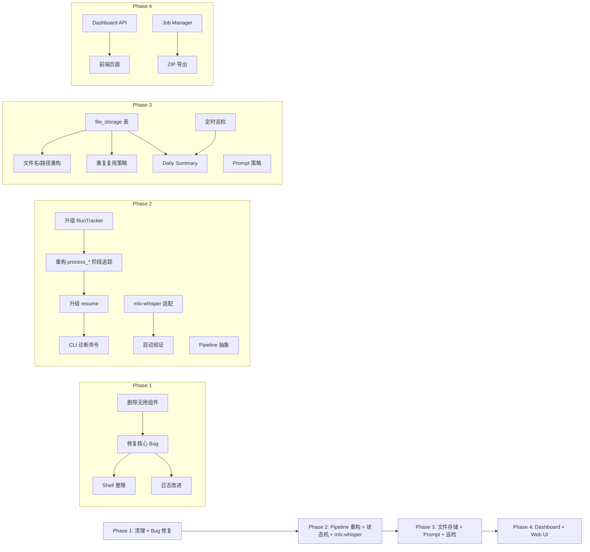

# YouTube Video Summary — 综合实施方案

> **基于** `doc/repo_quality_check_20260318.md` Step 1-7 分析结果  
> **编制日期**: 2026-03-19  
> **目标**: 将 7 个 Step 的改进项打乱整合为 **4 个实施阶段（Phase）**，按依赖关系和风险分级有序推进

---

## 目录

- [总览：阶段划分](#总览阶段划分)
- [Phase 1：清理 + Bug 修复 + 基础设施加固](#phase-1清理--bug-修复--基础设施加固)
- [Phase 2：Pipeline 重构 + 状态追踪 + Whisper 后端切换](#phase-2pipeline-重构--状态追踪--whisper-后端切换)
- [Phase 3：文件存储 + Prompt 策略 + 定时巡检](#phase-3文件存储--prompt-策略--定时巡检)
- [Phase 4：Dashboard + Web UI + ZIP 导出](#phase-4dashboard--web-ui--zip-导出)
- [全局依赖图](#全局依赖图)
- [实施时间线建议](#实施时间线建议)

---

## 总览：阶段划分

| Phase | 涵盖原始 Step | 核心主题 | 风险 | 预估工作量 |
|-------|-------------|----------|------|-----------|
| **1** | Step 1 + Step 1/2 Bug 修复 + Step 7 shell 整理 | 清理 + Bug 修复 + 日志改进 | 🟢 低 | 1-2 天 |
| **2** | Step 2 + Step 3 + Step 1 架构改进 | Pipeline 重构 + 状态机 + mlx-whisper | 🟡 中 | 3-5 天 |
| **3** | Step 4 + Step 5 + Step 6 | 文件存储 + 定时巡检 + Prompt 策略 | 🟡 中 | 5-7 天 |
| **4** | Step 7 | Dashboard + Web UI + ZIP | 🟡 中 | 3-5 天 |

---

## Phase 1：清理 + Bug 修复 + 基础设施加固

> **目标**: 低风险地消除技术债，让代码库进入健康状态，为后续重构打基础。

### 1.1 删除无用组件

| # | 操作 | 文件 | 说明 |
|---|------|------|------|
| 1 | **删除** | `src/notion_handler.py` | 用户确认不再使用 Notion 集成 |
| 2 | **删除** | `src/upload_to_github.py` | 功能与 `github_handler.py` 重复 |
| 3 | **删除** | `start_ytb_summary.sh` | 仅为 tmux session 管理，非项目功能 |
| 4 | **移除依赖** | `requirements.txt` | 删除 `ffmpeg-python` 和 `tqdm`（从未 import） |
| 5 | **清理 import** | `src/main.py` | 移除 `clean_temp_files` 的无用 import |
| 6 | **清理函数** | `src/utils.py` | 移除未使用的 `clean_temp_files()`、`ensure_dir_exists()`、`extract_podcast_id()` |
| 7 | **清理方法** | `src/transcriber.py` | 移除未使用的 `save_as_txt()` 方法 |
| 8 | **清理文档** | 各文档 | 移除 CLAUDE.md / README 中的 Notion 相关引用 |

### 1.2 修复核心 Bug

| # | Bug | 文件 | 修复方式 |
|---|-----|------|----------|
| 1 | `format_duration()` 超 24 小时回绕 | `src/utils.py` | 改用 `int(total_seconds())` 替代 `timedelta.seconds` |
| 2 | 错误状态统一标记为 `SUMMARY_FAILED` | `src/main.py` | 在 catch-all 中根据 `current_stage` 动态设置状态（Phase 2 完善，Phase 1 先做简单的 stage 变量传递） |
| 3 | `bash/quick-run.sh` 路径错误 | `bash/quick-run.sh` | `cd "$SCRIPT_DIR/.."` 回到项目根目录 |
| 4 | `.env.example` vs `settings.py` 默认值不一致 | `.env.example` + `config/settings.py` | 统一 `OPENROUTER_MODEL` 和 `WHISPER_LANGUAGE` 的默认值 |
| 5 | `log_failure()` 每次创建新文件 | `src/run_tracker.py` | 改为按会话追加到同一失败日志文件 |

**`log_failure()` 修复代码**：

```python
# run_tracker.py: 改为每个会话一个失败日志文件
_session_failure_log = None

def log_failure(run_type, identifier, url_or_path, error_message, stage=None):
    global _session_failure_log
    if _session_failure_log is None:
        timestamp = datetime.now().strftime("%Y%m%d_%H%M%S")
        _session_failure_log = config.LOG_DIR / f"failures_{timestamp}.txt"
    with open(_session_failure_log, 'a', encoding='utf-8') as f:
        f.write(f"[{datetime.now():%Y-%m-%d %H:%M:%S}] stage={stage or 'unknown'} | "
                f"type={run_type} | id={identifier}\n")
        f.write(f"  URL/Path: {url_or_path}\n")
        f.write(f"  Error: {error_message}\n\n")
```

### 1.3 Shell 脚本整理

1. 修复所有 `bash/*.sh` 的路径问题：统一 `cd "$SCRIPT_DIR/.."`
2. 统一 shell 脚本位置：全部放在 `bash/`，根目录只保留一个入口脚本
3. 删除 `start_ytb_summary.sh`（1.1 已处理）

### 1.4 测试文件整理

将 `test_api_key.py`、`test_ffmpeg.py`、`test_whisper_ffmpeg.py` 从 `tests/` 移到 `scripts/` 或 `tools/` 目录（它们不是真正的 unit test，无法通过 `python -m unittest discover` 运行）。

### 1.5 日志清理机制

添加日志自动清理（如保留最近 30 天的日志），防止 `logs/` 目录持续膨胀。

---

### Phase 1 验证清单

```bash
# 1. 确认删除的文件不被任何模块引用
grep -r "notion_handler\|upload_to_github\|clean_temp_files\|ensure_dir_exists" src/

# 2. 运行现有测试
python -m unittest discover tests

# 3. 验证 format_duration 修复
python -c "from src.utils import format_duration; print(format_duration(90000))"  # 应输出 25:00:00

# 4. 验证 quick-run.sh 路径
bash bash/quick-run.sh  # 应能正确找到 venv

# 5. 验证 log_failure 合并日志
# 运行一次产生失败的批处理，检查 logs/ 下只生成一个 failures_ 文件
```

---

## Phase 2：Pipeline 重构 + 状态追踪 + Whisper 后端切换

> **目标**: 重构核心处理管线架构，加入精确的阶段追踪与断点续传，同时完成 Whisper 后端的 Apple Silicon 优化。

### 2.1 新的状态机设计

```
Pipeline Stage Flow（每个 run 的状态流转）:

  ┌───────────┐
  │  PENDING   │  ← start_run() 创建
  └─────┬─────┘
        │
        ▼
  ┌───────────┐     ┌─────────────────┐
  │ DOWNLOADING│────►│ DOWNLOAD_FAILED  │
  └─────┬─────┘     └─────────────────┘
        │
        ▼
  ┌───────────┐     ┌──────────────────┐
  │TRANSCRIBING│───►│ TRANSCRIBE_FAILED │
  └─────┬─────┘     └──────────────────┘
        │
        ▼
  ┌─────────────────┐
  │TRANSCRIPT_READY  │
  └─────┬───────────┘
        │
        ▼
  ┌───────────┐     ┌─────────────────┐
  │SUMMARIZING │───►│ SUMMARIZE_FAILED │
  └─────┬─────┘     └─────────────────┘
        │
        ▼
  ┌─────────────────┐
  │ SUMMARY_READY    │
  └─────┬───────────┘
        │
        ▼ (optional, only if --upload)
  ┌───────────┐     ┌────────────────┐
  │ UPLOADING  │───►│ UPLOAD_FAILED   │
  └─────┬─────┘     └────────────────┘
        │
        ▼
  ┌───────────┐
  │ COMPLETED  │
  └───────────┘
```

**可恢复的失败状态映射**：

```python
RESUMABLE_STATUS_MAP = {
    'DOWNLOAD_FAILED':   'download',
    'TRANSCRIBE_FAILED': 'transcribe',
    'TRANSCRIPT_READY':  'summarize',
    'SUMMARIZE_FAILED':  'summarize',
    'SUMMARY_READY':     'upload',
    'UPLOAD_FAILED':     'upload',
}
```

### 2.2 升级 RunTracker（`src/run_tracker.py`）

**DB Schema 新增字段**（通过 `ALTER TABLE` 向后兼容迁移）：

```sql
ALTER TABLE runs ADD COLUMN transcript_path TEXT;
ALTER TABLE runs ADD COLUMN summary_path TEXT;
ALTER TABLE runs ADD COLUMN report_path TEXT;
ALTER TABLE runs ADD COLUMN github_url TEXT;
ALTER TABLE runs ADD COLUMN model_used TEXT;
ALTER TABLE runs ADD COLUMN audio_path TEXT;
ALTER TABLE runs ADD COLUMN summary_style TEXT;
ALTER TABLE runs ADD COLUMN retry_count INTEGER DEFAULT 0;
```

**新增方法**：

| 方法 | 功能 |
|------|------|
| `update_artifacts(run_id, **kwargs)` | 批量更新产物路径 |
| `increment_retry(run_id)` | 递增重试计数 |
| `get_resumable_runs(statuses=None)` | 返回所有可恢复状态的 run |

### 2.3 重构 `process_video()` 阶段追踪（`src/main.py`）

核心改动：用 `current_stage` 变量追踪当前阶段，catch-all 根据阶段动态设置失败状态：

```python
STAGE_TO_FAILED_STATUS = {
    'download':   RunStatus.DOWNLOAD_FAILED,
    'transcribe': RunStatus.TRANSCRIBE_FAILED,
    'summarize':  RunStatus.SUMMARIZE_FAILED,
    'upload':     RunStatus.UPLOAD_FAILED,
}
```

对 `process_local_mp3()` 和 `process_apple_podcast()` 做同样改动。

### 2.4 升级断点续传 `process_resume_only()`

根据失败状态决定从哪个阶段恢复：

- `DOWNLOAD_FAILED` → 完全重新处理
- `TRANSCRIBE_FAILED` → 需要音频文件存在才能重新转录，否则降级为完整重下载
- `TRANSCRIPT_READY` / `SUMMARIZE_FAILED` → 从摘要阶段恢复
- `SUMMARY_READY` / `UPLOAD_FAILED` → 从上传阶段恢复

### 2.5 新增 CLI 诊断命令

```bash
python src/main.py --status            # 显示处理统计
python src/main.py --list-failed       # 列出失败 run 的阶段和错误详情
python src/main.py --list-resumable    # 列出所有可恢复的 run
```

### 2.6 切换 mlx-whisper（Apple Silicon 优化）

#### 配置新增

```python
# config/settings.py
WHISPER_BACKEND = os.getenv('WHISPER_BACKEND', 'auto')

@staticmethod
def resolve_whisper_backend() -> str:
    backend = Config.WHISPER_BACKEND.lower().strip()
    if backend == 'auto':
        if platform.system() == 'Darwin' and platform.machine() == 'arm64':
            return 'mlx'
        return 'openai'
    return backend if backend in ('mlx', 'openai') else 'openai'
```

#### Transcriber 适配层重构

| 组件 | 职责 |
|------|------|
| `_OpenAIWhisperBackend` | 封装 `import whisper` + `model.transcribe()` |
| `_MLXWhisperBackend` | 封装 `import mlx_whisper` + `mlx_whisper.transcribe()` (含模型名→HF repo映射) |
| `_create_backend(model_name)` | 工厂方法，根据配置创建对应后端 |
| `Transcriber`（公开 API 不变） | 委托给后端适配器执行 |

**模型名映射表**（`_MLXWhisperBackend.MODEL_MAP`）：

| 官方名 | mlx-community repo |
|--------|--------------------|
| tiny | mlx-community/whisper-tiny-mlx |
| base | mlx-community/whisper-base-mlx |
| small | mlx-community/whisper-small-mlx |
| medium | mlx-community/whisper-medium-mlx |
| large | mlx-community/whisper-large-v3-mlx |
| turbo | mlx-community/whisper-turbo |

#### requirements.txt 更新

```txt
# Mac Apple Silicon:
mlx-whisper>=0.4.0; sys_platform == 'darwin' and platform_machine == 'arm64'
# Other platforms:
openai-whisper>=20231117; sys_platform != 'darwin' or platform_machine != 'arm64'
```

### 2.7 Pipeline 抽象（可选但推荐）

将 `main.py` 拆分为：

| 文件 | 职责 |
|------|------|
| `src/main.py` | CLI 入口 + 参数解析 |
| `src/pipeline.py` | 统一处理 pipeline（`ProcessingPipeline` 类） |
| `src/batch.py` | 批量处理逻辑（playlist / batch file / podcast show） |

**复用优化**：共享 `Transcriber` 和 `Summarizer` 实例，批量处理时避免重复加载 Whisper 模型和创建 HTTP session。

---

### Phase 2 实施顺序

```
2.2 升级 RunTracker  ──► 2.3 重构 process_*  ──► 2.4 升级 resume  ──► 2.5 CLI 命令
                                                                              
2.6 mlx-whisper (可并行)                                                      
  3.1 Config → 3.2 Transcriber → 3.3 依赖 → 3.4 .env → 3.5 启动验证          

2.7 Pipeline 抽象 (可并行或后置)
```

### Phase 2 验证清单

```bash
# 1. DB 迁移测试（新列添加）
python -c "from src.run_tracker import RunTracker; t = RunTracker(); print('OK')"

# 2. 状态追踪测试 - 模拟各阶段失败
python -m unittest tests/test_run_tracker.py

# 3. mlx-whisper 测试
python src/main.py -video "URL"
# 日志应显示: Whisper backend: mlx (mlx-whisper, Apple Silicon optimized)

# 4. 强制 openai 后端
WHISPER_BACKEND=openai python src/main.py -video "URL"

# 5. 诊断命令
python src/main.py --status
python src/main.py --list-resumable
python src/main.py --resume-only --upload
```

---

## Phase 3：文件存储 + Prompt 策略 + 定时巡检

> **目标**: 完善文件追踪与存储体系，实现按 UP 主差异化提示词策略，建立自动巡检与每日汇总机制。

### 3.1 `file_storage` 表设计（来自 Step 4）

```sql
CREATE TABLE IF NOT EXISTS file_storage (
    id INTEGER PRIMARY KEY AUTOINCREMENT,
    run_id INTEGER NOT NULL,
    file_type TEXT NOT NULL,        -- 'audio' | 'transcript' | 'summary' | 'report' | 'info' | 'prompt'
    file_path TEXT NOT NULL,
    file_size INTEGER,
    github_url TEXT,
    created_at TIMESTAMP NOT NULL,
    updated_at TIMESTAMP NOT NULL,
    deleted_at TIMESTAMP,           -- NULL = 存在，非 NULL = 已软删除
    FOREIGN KEY (run_id) REFERENCES runs(id)
);
```

**CRUD 方法新增**：

| 方法 | 说明 |
|------|------|
| `register_file(run_id, file_type, file_path, file_size)` | 注册文件，返回 file_storage_id |
| `get_files_for_run(run_id, file_type=None)` | 获取 run 的所有文件（排除已删除） |
| `mark_file_deleted(file_storage_id)` | 软删除文件 |
| `update_file_github_url(file_storage_id, github_url)` | 记录 GitHub URL |
| `find_latest_completed_report(identifier)` | 查找最新可用历史 report（用于重复视频复用） |

### 3.2 报告文件名与 GitHub 路径重构（来自 Step 4）

**新文件名格式**：

```
{upload_date}_{uploader}_{video_title_max20chars}.md
```

示例：`20260315_TechLead_Why-I-Left-Google.md`

**新 GitHub 目录结构**：

```
reports/
├── {uploader}/
│   ├── info.json
│   ├── summary_prompt.txt
│   └── {YYYY_MM}/
│       └── {upload_date}_{uploader}_{title}.md
├── daily_summary/
│   └── {YYYY_MM}/
│       └── {YYYY-MM-DD}.md
```

### 3.3 重复内容复用策略（来自 Step 4）

- YouTube `video_id` 为天然去重键
- 处理前先查询 `runs` + `file_storage` 是否存在同 `video_id` 的 `COMPLETED` run 且 report 文件仍存在
- 命中时直接复用历史 report，状态标记为 `REUSED_EXISTING_REPORT`
- playlist 内同一 `video_id` 只处理第一次

### 3.4 UP 主元信息（来自 Step 4）

**`info.json` 结构**：

```json
{
    "name": "TechLead",
    "description": "Ex-Google/Facebook Tech Lead...",
    "thumbnail_url": "https://yt3.ggpht.com/...",
    "channel_url": "https://www.youtube.com/@TechLead",
    "platform": "youtube",
    "first_seen": "2026-03-10T08:30:00",
    "last_updated": "2026-03-18T14:20:00",
    "total_videos_processed": 5
}
```

每次处理视频时创建/更新 `info.json`，上传到 GitHub。

### 3.5 按 UP 主动态选择提示词（来自 Step 6）

#### 配置文件

| 文件 | 用途 |
|------|------|
| `config/prompt_profile_map.csv` | UP 主 → prompt 类型映射（`uploader,prompt_type`） |
| `config/prompt_types/default.txt` | 默认提示词池 |
| `config/prompt_types/talk.txt` | 谈话类提示词池 |
| `config/prompt_types/education.txt` | 教育类提示词池 |
| `config/prompt_types/live.txt` | 直播类提示词池 |

每个 txt 文件内以 `---` 分隔多条 prompt，运行时随机选 1 条。

#### 新增模块：`src/prompt_selector.py`

```python
class PromptSelector:
    def select_for_uploader(self, uploader: str) -> dict:
        """Return: {prompt_text, prompt_type, match_source, prompt_index, prompt_file}"""
```

**回退策略**：

| 场景 | 回退行为 |
|------|----------|
| CSV 不存在 | 全部走 `default` |
| CSV 有该 UP 主但类型文件缺失 | 回退 `default`，记录错误 |
| `default.txt` 也缺失 | 回退 Summarizer 内置模板（最后防线） |
| prompt 选择异常 | 不阻塞主流程，继续摘要 |

#### Summarizer 接口改造

```python
def summarize(self, transcript, style="detailed", language="en",
              custom_prompt=None):
    if custom_prompt:
        prompt = custom_prompt
    else:
        prompt = self.create_prompt(transcript, style, language)
```

#### 数据库扩展（runs 表）

```sql
ALTER TABLE runs ADD COLUMN prompt_type TEXT;
ALTER TABLE runs ADD COLUMN prompt_source TEXT;   -- 'csv' | 'default'
ALTER TABLE runs ADD COLUMN prompt_index INTEGER;
ALTER TABLE runs ADD COLUMN prompt_file TEXT;
```

### 3.6 定时巡检 YouTube Up 主（来自 Step 5）

#### 架构

```
watchlist.txt / watch_channels 表
        ↓
channel_watcher.py
        ├─ load active watch targets
        ├─ fetch latest channel videos via yt-dlp
        ├─ compare with watcher_state / processed runs
        ├─ for each new video:
        │      ├─ if historical report exists → reuse
        │      └─ else → process_video(video_url, upload=True)
        └─ persist scan results + errors
                ↓
         daily summary / GitHub reports
```

#### 数据库设计（3 张新表）

| 表 | 职责 |
|----|------|
| `watch_channels` | 配置层：需要巡检的 UP 主列表 |
| `watch_channel_state` | 单个 UP 主的增量扫描状态 |
| `watch_scan_runs` | 每次定时任务的总体审计 |

#### 增量检测策略

1. `video_id` 已存在于 `runs.identifier` → 走历史 report 复用
2. `upload_date > last_seen_upload_date` → 新视频，进入处理队列
3. 同天多条视频：仍视为新视频
4. 无法获得 `upload_date`：回退基于 `video_id` 判断

#### 新增 CLI 命令

```bash
python src/main.py --import-watchlist watchlist.txt   # 导入关注列表
python src/main.py --list-watch-channels              # 查看关注频道
python src/main.py --watch-run-once --upload           # 执行一次巡检
python src/main.py --watch-daemon --watch-time 08:00   # 常驻服务模式
```

#### 调度方案（推荐 crontab / launchd）

```cron
0 8 * * * cd /path/to/ytb_video_summary && /path/to/venv/bin/python src/main.py --watch-run-once --upload >> logs/watch_cron.log 2>&1
```

#### 新增脚本：`bash/watch-run.sh`

```bash
#!/usr/bin/env bash
set -euo pipefail
SCRIPT_DIR="$( cd "$( dirname "${BASH_SOURCE[0]}" )" && pwd )"
cd "$SCRIPT_DIR/.."
source venv/bin/activate
python src/main.py --watch-run-once --upload
```

### 3.7 Daily Summary 系统（来自 Step 4）

**文件路径**：`output/reports/daily_summary/{YYYY_MM}/{YYYY-MM-DD}.md`

**内容格式**：

```markdown
# Daily Summary — 2026-03-18

## 📊 Processing Statistics

| Metric | Count |
|--------|-------|
| Total Processed | 5 |
| Successful | 4 |
| Failed | 1 |

## 📝 Processed Videos

| # | Uploader | Title | Status | PromptType | Model | Report |
|---|----------|-------|--------|------------|-------|--------|
| 1 | TechLead | Why I Left | ✅ COMPLETED | talk | deepseek-r1 | [查看](../TechLead/2026_03/report.md) |
| 2 | 李永乐老师 | 量子计算 | ♻️ REUSED | — | — | [历史总结](../李永乐老师/2026_03/report.md) |
```

**触发时机**：
- 批量处理 / watcher 巡检结束后自动调用
- 手动：`python src/main.py --daily-summary [DATE]`

---

### Phase 3 实施顺序

```
3.1 file_storage 表  ──► 3.3 重复复用策略  ──► 3.4 UP 主元信息
       │                        │
       ├──► 3.2 文件名/路径重构  │
       │                        │
       └──► 3.7 Daily Summary   │
                                │
3.5 Prompt 策略 (可并行)         │
  6.1 配置 → 6.2 Selector →    │
  6.3 Summarizer 接入 →        │
  6.4 持久化                    │
                                │
3.6 定时巡检 (依赖 3.1/3.3)     │
  5.1 DB → 5.2 频道抓取 →      │
  5.3 Watcher → 5.5 CLI →     │
  5.6 调度脚本 → 5.7 日报联动   │
```

### Phase 3 验证清单

```bash
# 1. file_storage CRUD 测试
python -m unittest tests/test_file_storage.py

# 2. 文件名格式测试
python -c "from src.utils import create_report_filename; print(create_report_filename('Title', uploader='UP主', upload_date='20260315'))"
# 应输出: 20260315_UP主_Title.md

# 3. Prompt 选择测试
python -m unittest tests/test_prompt_selector.py

# 4. 巡检测试
python src/main.py --import-watchlist watchlist.txt
python src/main.py --list-watch-channels
python src/main.py --watch-run-once --upload

# 5. Daily Summary
python src/main.py --daily-summary
```

---

## Phase 4：Dashboard + Web UI + ZIP 导出

> **目标**: 提供可部署的 Web 界面，支持查看历史总结、提交任务、下载 ZIP 结果包。

### 4.1 总体架构

```
Browser (Dashboard UI)
            ↓
FastAPI Web App (src/dashboard_app.py)
            ├─ GET  /api/runs            # 查询 runs + 筛选
            ├─ POST /api/jobs/playlist   # 创建 playlist 处理任务
            ├─ GET  /api/jobs/{id}       # 查询任务进度
            ├─ GET  /api/jobs/{id}/zip   # 下载 ZIP
            └─ GET  /dashboard           # Dashboard 页面
            ↓
SQLite (run_track.db) + Pipeline + file_storage
```

### 4.2 页面设计

| 区块 | 内容 |
|------|------|
| **统计卡片** | Total / Completed / Failed / Reused |
| **筛选区** | 日期范围、UP 主、状态、Prompt 类型、关键字搜索 |
| **列表表格** | Date、Uploader、Title、Status、PromptType、Model、Report Link |
| **详情抽屉** | 摘要正文、prompt 信息、文件路径与 GitHub URL |
| **任务提交 Tab** | API Key 输入、Playlist URL、摘要风格、GitHub 上传开关 |
| **下载区** | ZIP 下载按钮 |

### 4.3 新增模块

| 文件 | 职责 | 预估行数 |
|------|------|---------|
| `src/dashboard_app.py` | FastAPI app + 路由 | ~220 行 |
| `src/dashboard_service.py` | 查询聚合、过滤、分页 | ~140 行 |
| `src/job_manager.py` | 异步任务状态管理 | ~180 行 |
| `src/zip_exporter.py` | ZIP 打包 | ~120 行 |
| `web/dashboard.html` | 前端页面（HTML + CSS + Vanilla JS） | ~260 行 |
| `web/dashboard.md` | 使用说明文档 | ~120 行 |

### 4.4 ZIP 打包方案

**命名**：`summary_bundle_{job_id}_{YYYYMMDD_HHMM}.zip`

**目录结构**：

```
summary_bundle_job_xxx.zip
├── reports/*.md
├── transcripts/*.srt
├── metadata/
│   ├── job_manifest.json
│   ├── runs.csv
│   └── prompt_usage.csv
└── daily_summary/
    └── {date}.md
```

### 4.5 数据库扩展

```sql
CREATE TABLE IF NOT EXISTS web_jobs (
    id INTEGER PRIMARY KEY AUTOINCREMENT,
    job_id TEXT NOT NULL UNIQUE,
    job_type TEXT NOT NULL,
    status TEXT NOT NULL,   -- queued/running/completed/failed
    playlist_url TEXT,
    summary_style TEXT,
    total_count INTEGER DEFAULT 0,
    completed_count INTEGER DEFAULT 0,
    failed_count INTEGER DEFAULT 0,
    reused_count INTEGER DEFAULT 0,
    zip_path TEXT,
    created_at TIMESTAMP NOT NULL,
    updated_at TIMESTAMP NOT NULL
);

CREATE TABLE IF NOT EXISTS web_job_runs (
    id INTEGER PRIMARY KEY AUTOINCREMENT,
    job_id TEXT NOT NULL,
    run_id INTEGER NOT NULL,
    created_at TIMESTAMP NOT NULL
);
```

### 4.6 部署方案

```bash
# 方案 A（推荐）：FastAPI + Uvicorn + Nginx
uvicorn src.dashboard_app:app --host 127.0.0.1 --port 8080
# 配合 Nginx 反代 + HTTPS + Basic Auth

# 方案 B：纯内网
uvicorn src.dashboard_app:app --host 0.0.0.0 --port 8080
```

### 4.7 安全要点

- API Key 仅用于本次任务，放内存不落盘
- 默认仅监听 `127.0.0.1`
- 服务器部署通过 Nginx 反代 + 鉴权
- 失败堆栈不向前端暴露敏感信息

---

### Phase 4 验证清单

```bash
# 1. API 测试
curl "http://127.0.0.1:8080/api/runs?page=1&page_size=10"
curl -X POST http://127.0.0.1:8080/api/jobs/playlist -d '{...}'

# 2. 前端联调：浏览器访问 http://127.0.0.1:8080/dashboard

# 3. ZIP 内容验证
unzip -l output/zips/summary_bundle_*.zip

# 4. 安全回归：确认 API key 不出现在日志
```

---

## 全局依赖图



---

## 实施时间线建议

| 阶段 | 时间估算 | 关键里程碑 |
|------|---------|-----------|
| **Phase 1** | 第 1-2 天 | 代码库干净可测试 |
| **Phase 2** | 第 3-7 天 | 精确阶段追踪 + 断点续传 + mlx-whisper 可用 |
| **Phase 3** | 第 8-14 天 | 文件追踪完善 + 每日自动巡检 + prompt 差异化 |
| **Phase 4** | 第 15-19 天 | Dashboard 可部署使用 |

---

## 涉及文件总览

| 文件 | Phase | 操作类型 |
|------|-------|---------|
| `src/notion_handler.py` | P1 | 🗑 删除 |
| `src/upload_to_github.py` | P1 | 🗑 删除 |
| `start_ytb_summary.sh` | P1 | 🗑 删除 |
| `requirements.txt` | P1, P2 | ✏️ 修改 |
| `src/main.py` | P1, P2, P3 | ✏️ 修改 |
| `src/utils.py` | P1, P3 | ✏️ 修改 |
| `src/transcriber.py` | P1, P2 | ✏️ 修改 |
| `src/run_tracker.py` | P1, P2, P3 | ✏️ 修改 |
| `config/settings.py` | P1, P2 | ✏️ 修改 |
| `.env.example` | P1, P2, P3 | ✏️ 修改 |
| `bash/quick-run.sh` | P1 | ✏️ 修改 |
| `src/summarizer.py` | P3 | ✏️ 修改 |
| `src/github_handler.py` | P3 | ✏️ 修改 |
| `src/pipeline.py` | P2 | 🆕 新增 |
| `src/batch.py` | P2 | 🆕 新增 |
| `src/prompt_selector.py` | P3 | 🆕 新增 |
| `src/channel_watcher.py` | P3 | 🆕 新增 |
| `src/watch_repository.py` | P3 | 🆕 新增 |
| `src/daily_summary.py` | P3 | 🆕 新增 |
| `config/prompt_profile_map.csv` | P3 | 🆕 新增 |
| `config/prompt_types/*.txt` | P3 | 🆕 新增 |
| `bash/watch-run.sh` | P3 | 🆕 新增 |
| `src/dashboard_app.py` | P4 | 🆕 新增 |
| `src/dashboard_service.py` | P4 | 🆕 新增 |
| `src/job_manager.py` | P4 | 🆕 新增 |
| `src/zip_exporter.py` | P4 | 🆕 新增 |
| `web/dashboard.html` | P4 | 🆕 新增 |
| `web/dashboard.md` | P4 | 🆕 新增 |

---

> **向后兼容性原则**：每个 Phase 完成后，现有 CLI 用法 (`python src/main.py -video "URL"`) 必须正常工作。新功能均为增量添加，不破坏已有流程。
