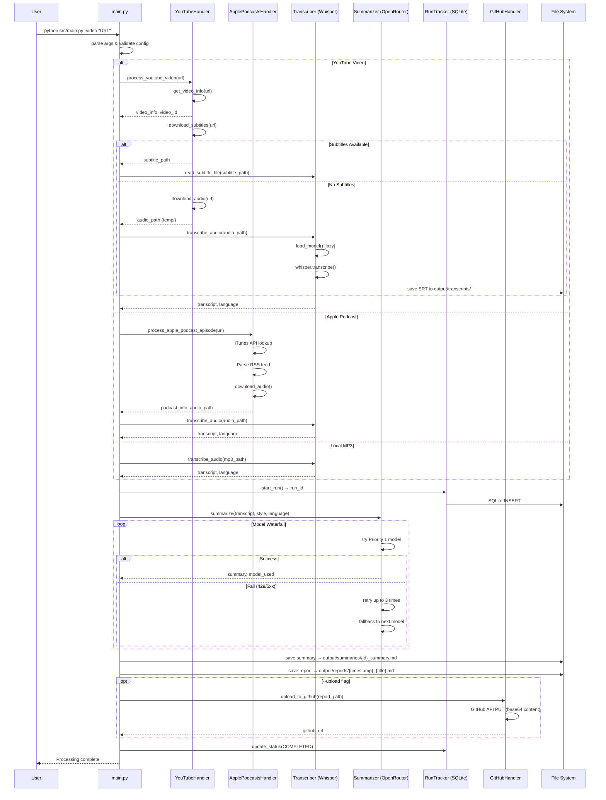
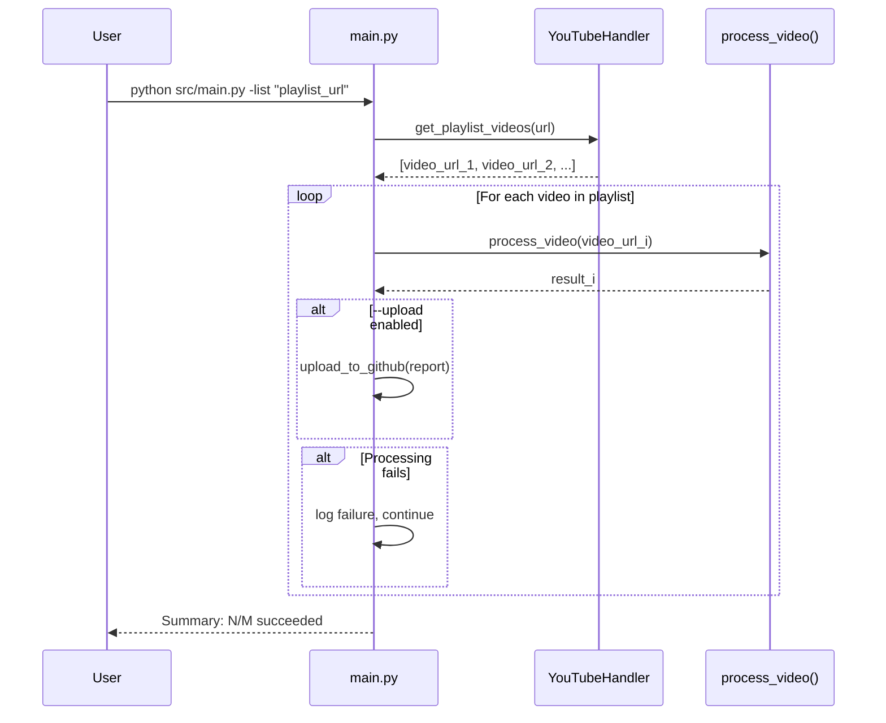
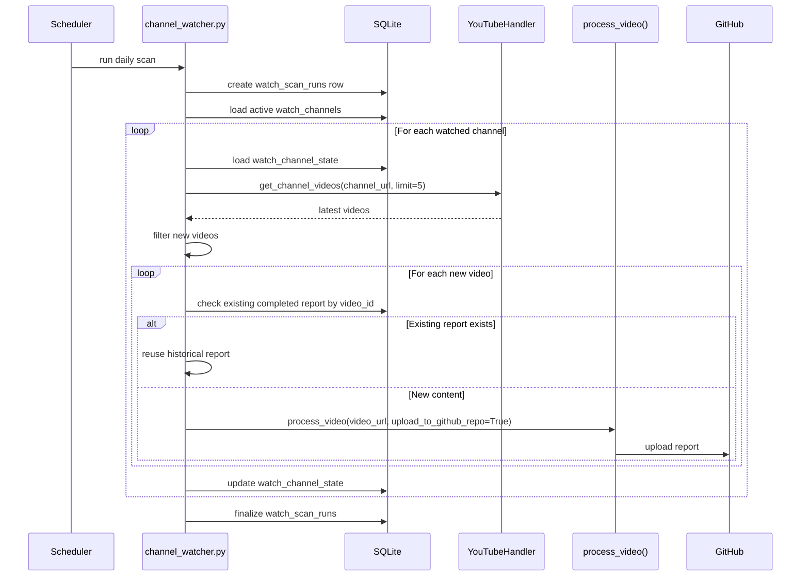

Step 1:

仔细检查这个repo
1. 哪些组件是没有必要的
2. 哪些是需要改进的
3. 给出data flow
4. 用memaid画出sequence diagram
5. 哪些是可能的bug
6. 给出改进方案。

现在只读取文件，不修改任何代码。
把你的发现写在这个md文件的末尾。

==========================================

## 代码库质量检查报告 (2026-03-18)

---

### 1. 不必要的组件

| 组件 | 路径 | 问题 |
|------|------|------|
| `ffmpeg-python` 依赖 | `requirements.txt` | 列在依赖中但代码中从未 `import ffmpeg`，完全未使用。FFmpeg 是通过系统命令 (`shutil.which`) 和 yt-dlp 的 postprocessor 调用的。 |
| `tqdm` 依赖 | `requirements.txt` | 列在依赖中但代码中从未 `import tqdm`，完全未使用。 |
| `upload_to_github.py` | `src/upload_to_github.py` | 独立的 CLI 脚本，功能与 `github_handler.py` 大量重复。两个文件都实现了 GitHub 上传逻辑，`upload_to_github.py` 实际上内部也调用了 `GitHubHandler`，应该合并或删除其中一个。 |
| `start_ytb_summary.sh` | 根目录 | 仅用于创建/连接 tmux session，不包含任何业务逻辑。属于个人开发环境配置，不应在项目中。 |
| `notion_handler.py` | `src/notion_handler.py` | **决定移除**。整个模块从未被调用，且配置缺失会导致 `AttributeError`。用户确认不再使用 Notion 集成，应直接删除。 |
| `clean_temp_files()` | `src/utils.py` | 在 `main.py` 中被 import 但从未被调用。音频清理是通过 `audio_path.unlink()` 直接完成的。 |
| `ensure_dir_exists()` | `src/utils.py` | 定义了但从未被任何模块调用，目录创建由 `Config.__init__` 统一处理。 |
| `extract_podcast_id()` | `src/utils.py` | 与 `ApplePodcastsHandler.extract_podcast_id()` 功能完全重复。 |
| `save_as_txt()` | `src/transcriber.py` | `Transcriber.save_as_txt()` 方法定义了但当前 pipeline 从未调用。 |
| 大量失败日志文件 | `logs/failures_*.txt` | `logs/` 目录积累了大量历史失败日志（80+文件），没有自动清理机制。 |

---

### 2. 需要改进的地方

#### 2.1 架构层面

- **代码重复严重**：`process_video()`、`process_local_mp3()`、`process_apple_podcast()` 三个函数有大量相同的模式（tracker 初始化 → 转录 → 摘要 → 输出 → GitHub 上传）。应抽象为统一的 pipeline 基类或策略模式。
- **`main.py` 过于臃肿**：1300+ 行，既是 CLI 入口又包含所有处理逻辑。`process_video`、`process_playlist`、`process_local_mp3`、`process_apple_podcast`、`process_apple_podcast_show`、`process_batch_file`、`process_resume_only` 全部在一个文件中。应拆分到独立的 pipeline 模块。
- **Summarizer 每次创建新实例**：`summarize_transcript()` 每次调用都创建新的 `Summarizer()` 实例，在批量处理场景下浪费资源。
- **Transcriber 每次创建新实例**：同上，`process_local_mp3()` 每次都新建 `Transcriber()` 并重新加载 Whisper 模型，而 `Transcriber` 内部设计了懒加载，但批量处理时无法复用。

#### 2.2 错误处理

- **error status 过于笼统**：所有失败都标记为 `SUMMARY_FAILED`，即使失败可能发生在 download、transcribe 阶段。`process_video()` 的 catch-all 块统一标记为 `SUMMARY_FAILED, stage='summarize'`，不准确。
- **`log_failure()` 每次创建新文件**：每次失败都创建 `failures_{timestamp}.txt` 新文件，导致 `logs/` 目录中积累了大量小文件，应该追加到同一个会话文件。
- **进度丢失风险**：在 `process_apple_podcast_show()` 中，对每个 episode 重新下载 RSS feed 和 podcast info（因为调用了 `process_apple_podcast(url, episode_index=idx)`），效率低且可能触发 API 限流。

#### 2.3 配置管理

- **Config 是 class-level 属性而非 instance-level**：所有配置项定义为类变量，`__init__` 只创建目录。这意味着如果 `.env` 在 import 后更改，配置不会更新（当然这在 CLI 工具中影响不大）。
- ~~**Notion 配置缺失**~~：已决定移除 `notion_handler.py`，此问题随之消除。
- **`.env.example` 与 `settings.py` 默认值不一致**：`.env.example` 中 `OPENROUTER_MODEL=openrouter/free`，但 `settings.py` 默认为 `deepseek/deepseek-r1`。

#### 2.4 测试覆盖

- **测试覆盖率极低**：仅有简单的 utility 函数测试（`format_timestamp`、`sanitize_filename`、`extract_video_id`、`format_duration`）和一个 waterfall fallback 测试。核心 pipeline 逻辑（`process_video`、`process_local_mp3`）没有任何测试。
- **`test_api_key.py`、`test_ffmpeg.py`、`test_whisper_ffmpeg.py` 不是真正的 unit test**：这些是手动运行的诊断脚本，不继承 `unittest.TestCase`，无法通过 `python -m unittest discover` 运行（`test_api_key.py` 甚至会发起真实 API 调用）。

#### 2.5 安全性

- `output/cookies.txt` 存在于仓库中（即使 `.gitignore` 可能已忽略），cookies 文件包含敏感会话信息。
- `test_api_key.py` 脚本会打印 API key 的前 20 个字符，存在泄漏风险。

---

### 3. Data Flow

```
Input Source                Processing Pipeline                    Output
─────────────────    ─────────────────────────────    ─────────────────────────

YouTube Video URL    ┌─► YouTubeHandler                 output/transcripts/
YouTube Playlist  ───┤   ├─ get_video_info()             ├── {video_id}_transcript.srt
                     │   ├─ download_subtitles()
                     │   └─ download_audio()  ──► temp/  output/summaries/
                     │                                    ├── {video_id}_summary.md
                     │   ┌─ Transcriber
Apple Podcast URL ───┼─► │  ├─ load_model() (Whisper)    output/reports/
                     │   │  ├─ transcribe_audio()         ├── {timestamp}_{uploader}_{title}.md
                     │   │  └─ save_as_srt()
                     │   │                                (Optional)
Local MP3 Folder  ───┤   └─ Summarizer                   ├── GitHub repo upload
                     │      ├─ create_prompt()            └── logs/run_track.db
                     │      ├─ summarize() [waterfall]
                     │      └─ save_summary()
                     │
Batch File (mix)  ───┘   RunTracker (SQLite)
                         ├─ start_run()
                         ├─ update_status()
                         └─ log_failure()
```

**详细流**:
1. **输入解析**: `main.py` 解析 CLI 参数，检测输入类型（YouTube video/playlist、Apple Podcast、local MP3、batch file）
2. **内容获取**: 根据输入类型调用对应 handler 下载/定位音频内容
   - YouTube: `yt-dlp` 下载字幕或音频到 `temp/`
   - Apple Podcasts: iTunes API → RSS feed → 下载音频到 `temp/`
   - Local MP3: 直接读取文件
3. **转录**: 如果没有字幕，使用 OpenAI Whisper 本地转录音频为文本 + SRT
4. **AI 摘要**: 通过 OpenRouter API（model waterfall: Priority1 → 2 → 3 → Fallback）生成结构化摘要
5. **输出**: 保存 SRT 转录、摘要文件和报告文件；可选上传到 GitHub
6. **追踪**: RunTracker 在 SQLite 中记录每次处理的状态

---

### 4. Sequence Diagram



#### 批量处理（Playlist / Batch File）



---

### 5. 可能的 Bug

#### ~~Bug 1: `notion_handler.py` 引用不存在的配置项~~ ✅ 已决定删除

已确认移除 Notion 集成，直接删除 `src/notion_handler.py` 即可。

#### Bug 2: `format_duration()` 对超过 24 小时的时长结果错误

**文件**: `src/utils.py` L130-140

```python
def format_duration(seconds: int) -> str:
    duration = timedelta(seconds=seconds)
    hours = duration.seconds // 3600  # ❌ timedelta.seconds 最大只到 86399
```

`timedelta.seconds` 只返回时间部分的秒数（0-86399），不包含 `days`。如果视频超过 24 小时（如长直播），`duration.seconds` 会"回绕"。应该使用 `int(duration.total_seconds())`。

**修复**:
```python
total = int(duration.total_seconds())
hours = total // 3600
minutes = (total % 3600) // 60
secs = total % 60
```

#### Bug 3: 错误状态标记不准确

**文件**: `src/main.py` L161 (process_video 的 except 块)

```python
except Exception as e:
    ...
    if run_id:
        tracker.update_status(run_id, 'SUMMARY_FAILED', str(e), stage='summarize')
```

即使异常发生在 Step 1（download）或 Step 2（transcribe），状态也会被标记为 `SUMMARY_FAILED, stage='summarize'`。这会导致 `--resume-only` 模式误判可以恢复的 run（resume 逻辑只查找 `TRANSCRIPT_GENERATED` 和 `SUMMARY_FAILED`）。

#### Bug 4: `process_apple_podcast_show()` 重复下载

**文件**: `src/main.py` L740-751

在 `process_apple_podcast_show()` 中，循环对每个 episode 调用 `process_apple_podcast(url, episode_index=idx)`，而 `process_apple_podcast` 每次都重新执行:
1. `extract_podcast_id(url)`
2. `get_podcast_info(podcast_id)` — iTunes API 调用
3. `get_rss_feed(feed_url)` — RSS feed 下载和解析

对于一个 100 集的播客，会发送 100 次 iTunes API 请求 + 100 次 RSS feed 下载。

#### Bug 5: `quick-run.sh` 路径错误

**文件**: `bash/quick-run.sh` L7

```bash
SCRIPT_DIR="$( cd "$( dirname "${BASH_SOURCE[0]}" )" && pwd )"
cd "$SCRIPT_DIR"
```

脚本位于 `bash/` 子目录，但 `cd "$SCRIPT_DIR"` 后 `source venv/bin/activate` 会在 `bash/` 目录下寻找 `venv/`，而虚拟环境在项目根目录。应该 `cd "$SCRIPT_DIR/.."` 或使用相对路径。

#### Bug 6: Whisper 语言设置不一致

**文件**: `config/settings.py` vs `.env.example`

`settings.py` 中 `WHISPER_LANGUAGE = os.getenv('WHISPER_LANGUAGE', 'zh')`，默认中文。但 `.env.example` 中 `WHISPER_LANGUAGE=auto`。如果用户复制 `.env.example` 但不修改，Whisper 会使用 `auto`；如果不创建 `.env`，默认是 `zh`。`Transcriber.__init__` 中 `self.language = language if language != 'auto' else None`，所以 `auto` 会变成 `None`，让 Whisper 自动检测——这本身不是 bug 但默认值的差异可能造成困惑。

#### Bug 7: 摘要 waterfall 在 429 时未正确切换模型

**文件**: `src/summarizer.py` L120-145

```python
mock_post.side_effect = [http_error, ok_response]
# 测试中 mock 只有两个响应:
# 1. model-a attempt 1: 429 → retry (sleep)
# 2. model-a attempt 2: ok_response → success
```

实际上第一个模型的第一次 429 只是触发 retry，不会切换模型。测试 (`test_summarizer_fallback.py`) 验证了 `mock_post.call_count == 2` 且最终返回 `model-a`。但如果三次重试全部 429，waterfall 的 `break` 逻辑正确切换到下一个模型。这本身不是 bug，但 429 backoff 时间很短 (2, 4, 8 秒)，对于 rate limit 来说可能不够。

#### Bug 8: 每次失败创建独立日志文件

**文件**: `src/run_tracker.py` L190-196

```python
def log_failure(...):
    timestamp = datetime.now().strftime("%Y%m%d_%H%M%S")
    log_filename = f"failures_{timestamp}.txt"  # 每次调用都创建新文件
```

如果在同一秒内有多次失败（批量处理场景），`timestamp` 相同会导致写入同一文件（`mode='a'`），但更常见的是每个失败都创建独立文件，导致 `logs/` 目录膨胀（目前已有 80+ 文件）。

---

### 6. 改进方案（已调整）

> **用户决策**：不再使用 Notion API，`notion_handler.py` 直接删除。改进方案已据此调整。

#### Step 1: 清理无用组件（立即执行，低风险）

| # | 操作 | 文件 | 说明 |
|---|------|------|------|
| 1 | **删除** | `src/notion_handler.py` | 用户确认不再使用 Notion 集成 |
| 2 | **删除** | `src/upload_to_github.py` | 功能与 `github_handler.py` 重复，主 pipeline 已使用后者 |
| 3 | **删除** | `start_ytb_summary.sh` | 仅为 tmux session 管理，非项目功能 |
| 4 | **移除依赖** | `requirements.txt` | 删除 `ffmpeg-python` 和 `tqdm`（从未 import） |
| 5 | **清理 import** | `src/main.py` | 移除 `clean_temp_files` 的无用 import |
| 6 | **清理函数** | `src/utils.py` | 移除未使用的 `clean_temp_files()`、`ensure_dir_exists()`、`extract_podcast_id()` |
| 7 | **清理方法** | `src/transcriber.py` | 移除未使用的 `save_as_txt()` 方法 |
| 8 | **移除 CLAUDE.md/README 中的 Notion 相关文档** | 各文档 | 清理过时引用 |

#### Step 2: 修复核心 Bug（高优先级）

| # | Bug | 修复方式 |
|---|-----|----------|
| 1 | `format_duration()` 超 24 小时回绕 | 改用 `int(total_seconds())` 替代 `timedelta.seconds` |
| 2 | 错误状态统一标记为 `SUMMARY_FAILED` | 在 `process_video()` 的 catch-all 中根据当前 stage 动态设置状态 |
| 3 | `bash/quick-run.sh` 路径错误 | `cd "$SCRIPT_DIR/.."` 回到项目根目录 |
| 4 | `.env.example` vs `settings.py` 默认值不一致 | 统一 `OPENROUTER_MODEL` 和 `WHISPER_LANGUAGE` 的默认值 |
| 5 | `log_failure()` 每次创建新文件 | 改为按会话追加到同一失败日志文件 |

#### Step 3: 优化日志系统

```python
# run_tracker.py: 改为每个会话一个失败日志文件
_session_failure_log = None

def log_failure(run_type, identifier, url_or_path, error_message):
    global _session_failure_log
    if _session_failure_log is None:
        timestamp = datetime.now().strftime("%Y%m%d_%H%M%S")
        _session_failure_log = config.LOG_DIR / f"failures_{timestamp}.txt"
    with open(_session_failure_log, 'a', encoding='utf-8') as f:
        ...
```

添加日志清理机制（如保留最近 30 天的日志）。

#### Step 4: Pipeline 抽象重构（中优先级）

将 `process_video()`、`process_local_mp3()`、`process_apple_podcast()` 重构为统一 pipeline，消除重复代码：

```python
class ProcessingPipeline:
    def __init__(self, tracker, transcriber, summarizer):
        self.tracker = tracker
        self.transcriber = transcriber  # 复用 Whisper 模型
        self.summarizer = summarizer    # 复用 HTTP session
        self._current_stage = 'init'

    def process(self, source: AudioSource) -> Result:
        run_id = self.tracker.start_run(...)
        try:
            self._current_stage = 'download'
            audio = source.acquire()           # 多态: YouTube/Podcast/Local
            self._current_stage = 'transcribe'
            transcript = self._transcribe(audio)
            self._current_stage = 'summarize'
            summary = self._summarize(transcript)
            self._current_stage = 'output'
            self._output(summary)
            self.tracker.update_status(run_id, 'COMPLETED')
        except Exception as e:
            self.tracker.update_status(run_id, 'FAILED',
                stage=self._current_stage, error_message=str(e))
            raise
```

同时将 `main.py` 拆分为：
- `src/main.py` — CLI 入口 + 参数解析
- `src/pipeline.py` — 统一处理 pipeline
- `src/batch.py` — 批量处理逻辑（playlist / batch file / podcast show）

#### Step 5: 性能优化

1. **Whisper 模型复用**：在批量处理中传递共享的 `Transcriber` 实例，避免重复加载模型
2. **HTTP Session 复用**：`Summarizer` 使用 `requests.Session()` 代替每次 `requests.post()`
3. **Podcast RSS feed 缓存**：`process_apple_podcast_show()` 只下载一次 feed，将 episode 数据直接传递给处理函数

#### Step 6: 提升测试覆盖

1. 将 `test_api_key.py`、`test_ffmpeg.py`、`test_whisper_ffmpeg.py` 从 `tests/` 移到 `scripts/` 或 `tools/` 目录（它们不是 unit test）
2. 为 `ProcessingPipeline` 添加 mock 集成测试
3. 为 `RunTracker` 添加数据库操作测试
4. 为 `ApplePodcastsHandler` 添加 RSS 解析测试
5. 目标：核心 pipeline 测试覆盖率 > 60%

#### Step 7: Shell 脚本整理

1. 修复所有 `bash/*.sh` 的路径问题：统一 `cd "$SCRIPT_DIR/.."`
2. 统一 shell 脚本位置（建议全部放在 `bash/`，根目录只保留一个入口脚本）
3. 删除 `start_ytb_summary.sh`（Step 1 已处理）

=======================================================

Step 2: 
- 运行状态的tracking和断点续传功能
- track the process of each video: 字幕准备（包括下载或转录）、摘要生成、GitHub上传
- 失败时记录失败原因和阶段，支持后续分析和重试，而不是简单地标记为 SUMMARY_FAILED

=================================================

## Step 2 改进方案：运行状态追踪与断点续传

---

### 当前问题总结

通过代码审查，当前 `RunTracker` + `process_*()` 函数存在以下问题：

| # | 问题 | 位置 | 影响 |
|---|------|------|------|
| 1 | **所有失败统一标记为 `SUMMARY_FAILED`** | `process_video()` / `process_local_mp3()` / `process_apple_podcast()` 的 catch-all `except` 块 | 无法区分是下载失败、转录失败还是摘要失败，`--resume-only` 无法正确判断从哪里恢复 |
| 2 | **stage 记录与实际阶段脱节** | catch-all 块中硬编码 `stage='summarize'` | 即使异常发生在 download 阶段，stage 也被记为 `summarize` |
| 3 | **resume 只支持从摘要阶段恢复** | `process_resume_only()` 只查找 `TRANSCRIPT_GENERATED` 和 `SUMMARY_FAILED` | 下载或转录阶段失败的 run 无法恢复 |
| 4 | **GitHub 上传失败不被追踪** | `upload_to_github()` 失败只 log warning | 无法知道哪些 run 已有摘要但未上传到 GitHub |
| 5 | **DB schema 缺少关键字段** | `runs` 表缺少 `transcript_path`、`summary_path`、`report_path` 等 | resume 时需要硬编码路径规则来"猜测"文件位置 |
| 6 | **每次失败创建独立日志文件** | `log_failure()` 每次调用都创建 `failures_{timestamp}.txt` | `logs/` 目录膨胀（当前 80+ 文件），应按会话合并 |

---

### 设计目标

1. **精确的阶段追踪**：每个 run 记录当前所处的 pipeline 阶段和对应状态
2. **失败精确定位**：失败时记录真实的失败阶段和错误信息
3. **智能断点续传**：根据失败阶段自动决定从哪一步恢复，避免重复工作
4. **产物路径持久化**：在 DB 中记录每一步的输出文件路径，resume 时直接读取而非猜测
5. **GitHub 上传追踪**：上传状态纳入 pipeline 追踪体系

---

### 新的状态机设计

```
Pipeline Stage Flow（每个 run 的状态流转）:

  ┌───────────┐
  │  PENDING   │  ← start_run() 创建
  └─────┬─────┘
        │
        ▼
  ┌───────────┐     ┌─────────────────┐
  │ DOWNLOADING│────►│ DOWNLOAD_FAILED  │ ← 下载视频/音频或字幕失败
  └─────┬─────┘     └─────────────────┘
        │
        ▼
  ┌───────────┐     ┌──────────────────┐
  │TRANSCRIBING│───►│ TRANSCRIBE_FAILED │ ← Whisper 转录失败
  └─────┬─────┘     └──────────────────┘
        │
        ▼
  ┌─────────────────┐
  │TRANSCRIPT_READY  │ ← 转录/字幕文本已就绪
  └─────┬───────────┘
        │
        ▼
  ┌───────────┐     ┌─────────────────┐
  │SUMMARIZING │───►│ SUMMARIZE_FAILED │ ← AI 摘要生成失败
  └─────┬─────┘     └─────────────────┘
        │
        ▼
  ┌─────────────────┐
  │ SUMMARY_READY    │ ← 摘要已生成，输出文件已保存
  └─────┬───────────┘
        │
        ▼ (optional, only if --upload)
  ┌───────────┐     ┌────────────────┐
  │ UPLOADING  │───►│ UPLOAD_FAILED   │ ← GitHub 上传失败
  └─────┬─────┘     └────────────────┘
        │
        ▼
  ┌───────────┐
  │ COMPLETED  │ ← 全部完成
  └───────────┘
```

**状态枚举定义**：

```python
class RunStatus:
    """Pipeline run status constants"""
    PENDING            = 'PENDING'
    DOWNLOADING        = 'DOWNLOADING'
    DOWNLOAD_FAILED    = 'DOWNLOAD_FAILED'
    TRANSCRIBING       = 'TRANSCRIBING'
    TRANSCRIBE_FAILED  = 'TRANSCRIBE_FAILED'
    TRANSCRIPT_READY   = 'TRANSCRIPT_READY'
    SUMMARIZING        = 'SUMMARIZING'
    SUMMARIZE_FAILED   = 'SUMMARIZE_FAILED'
    SUMMARY_READY      = 'SUMMARY_READY'
    UPLOADING          = 'UPLOADING'
    UPLOAD_FAILED      = 'UPLOAD_FAILED'
    COMPLETED          = 'COMPLETED'

# 可恢复的失败状态 → 恢复起始阶段
RESUMABLE_STATUS_MAP = {
    'DOWNLOAD_FAILED':   'download',     # 重新下载
    'TRANSCRIBE_FAILED': 'transcribe',   # 重新转录（需要音频文件存在）
    'TRANSCRIPT_READY':  'summarize',    # 跳过下载和转录，直接摘要
    'SUMMARIZE_FAILED':  'summarize',    # 重新摘要
    'SUMMARY_READY':     'upload',       # 跳过摘要，直接上传
    'UPLOAD_FAILED':     'upload',       # 重新上传
}
```

---

### DB Schema 升级

在现有 `runs` 表基础上新增字段，通过 `ALTER TABLE` 迁移：

```sql
-- 新增字段（如果不存在）
ALTER TABLE runs ADD COLUMN transcript_path TEXT;   -- 转录文件路径 (SRT)
ALTER TABLE runs ADD COLUMN summary_path TEXT;      -- 摘要文件路径
ALTER TABLE runs ADD COLUMN report_path TEXT;       -- 报告文件路径
ALTER TABLE runs ADD COLUMN github_url TEXT;        -- GitHub 上传后的 URL
ALTER TABLE runs ADD COLUMN model_used TEXT;        -- 摘要使用的模型
ALTER TABLE runs ADD COLUMN audio_path TEXT;        -- 音频文件路径（用于转录恢复）
ALTER TABLE runs ADD COLUMN summary_style TEXT;     -- 摘要风格 (brief/detailed)
ALTER TABLE runs ADD COLUMN retry_count INTEGER DEFAULT 0;  -- 重试次数
```

**迁移策略**：在 `_init_database()` 中检查列是否存在，不存在则 `ALTER TABLE ADD COLUMN`，与现有 `stage` 列的迁移方式一致。

---

### 实现计划

#### 任务 2.1：升级 `RunTracker` 类（`src/run_tracker.py`）

**改动点**：

1. **添加 `RunStatus` 常量类**（文件顶部）

2. **扩展 `_init_database()`**：添加新字段的迁移逻辑

   ```python
   new_columns = {
       'transcript_path': 'TEXT',
       'summary_path': 'TEXT',
       'report_path': 'TEXT',
       'github_url': 'TEXT',
       'model_used': 'TEXT',
       'audio_path': 'TEXT',
       'summary_style': 'TEXT',
       'retry_count': 'INTEGER DEFAULT 0',
   }
   for col_name, col_type in new_columns.items():
       if col_name not in columns:
           cursor.execute(f"ALTER TABLE runs ADD COLUMN {col_name} {col_type}")
   ```

3. **新增 `update_artifacts()` 方法**：批量更新产物路径

   ```python
   def update_artifacts(self, run_id: int, **kwargs):
       """Update artifact paths and metadata for a run.
       
       Accepted kwargs: transcript_path, summary_path, report_path,
                        github_url, model_used, audio_path, summary_style
       """
       allowed = {'transcript_path', 'summary_path', 'report_path',
                  'github_url', 'model_used', 'audio_path', 'summary_style'}
       updates = {k: v for k, v in kwargs.items() if k in allowed and v is not None}
       if not updates:
           return
       set_clause = ", ".join(f"{k} = ?" for k in updates)
       params = list(updates.values()) + [run_id]
       with sqlite3.connect(self.db_path) as conn:
           conn.execute(
               f"UPDATE runs SET {set_clause}, updated_at = ? WHERE id = ?",
               (*updates.values(), datetime.now(), run_id)
           )
           conn.commit()
   ```

4. **新增 `increment_retry()` 方法**：

   ```python
   def increment_retry(self, run_id: int):
       with sqlite3.connect(self.db_path) as conn:
           conn.execute(
               "UPDATE runs SET retry_count = COALESCE(retry_count, 0) + 1, updated_at = ? WHERE id = ?",
               (datetime.now(), run_id)
           )
           conn.commit()
   ```

5. **升级 `get_resumable_runs()`**：支持新的失败状态列表

   ```python
   def get_resumable_runs(self, statuses=None):
       statuses = statuses or list(RESUMABLE_STATUS_MAP.keys())
       # ... 查询逻辑不变，但默认包含所有可恢复状态
   ```

6. **改进 `log_failure()`**：改为按会话追加到同一文件

   ```python
   _session_failure_log = None

   def log_failure(run_type, identifier, url_or_path, error_message, stage=None):
       global _session_failure_log
       if _session_failure_log is None:
           timestamp = datetime.now().strftime("%Y%m%d_%H%M%S")
           _session_failure_log = config.LOG_DIR / f"failures_{timestamp}.txt"
       with open(_session_failure_log, 'a', encoding='utf-8') as f:
           f.write(f"[{datetime.now():%Y-%m-%d %H:%M:%S}] [{stage or 'unknown'}] "
                   f"{run_type} | {identifier} | {url_or_path}\n")
           f.write(f"  Error: {error_message}\n\n")
   ```

---

#### 任务 2.2：重构 `process_video()` 阶段追踪（`src/main.py`）

**核心改动**：用阶段变量 `current_stage` 追踪当前阶段，catch-all 根据阶段动态设置失败状态。

```python
def process_video(url, cookies_file=None, ..., upload_to_github_repo=False):
    tracker = get_tracker()
    run_id = None
    video_id = None
    current_stage = 'download'  # ← 阶段追踪变量

    try:
        # === Stage: Download ===
        current_stage = 'download'
        tracker.update_status(run_id, RunStatus.DOWNLOADING, stage='download') if run_id else None
        
        result = process_youtube_video(url, ...)
        video_id = result['video_id']
        run_id = tracker.start_run('youtube', url, video_id)
        tracker.update_status(run_id, RunStatus.DOWNLOADING, stage='download')

        # === Stage: Transcribe ===
        current_stage = 'transcribe'
        tracker.update_status(run_id, RunStatus.TRANSCRIBING, stage='transcribe')
        
        if result['needs_transcription']:
            transcript, lang = transcribe_video_audio(audio_path, video_id, save_srt=True)
            tracker.update_artifacts(run_id, audio_path=str(audio_path))
        else:
            transcript, lang = read_subtitle_file(result['subtitle_path'])
        
        srt_path = config.TRANSCRIPT_DIR / f"{video_id}_transcript.srt"
        tracker.update_status(run_id, RunStatus.TRANSCRIPT_READY, stage='transcribe')
        tracker.update_artifacts(run_id, transcript_path=str(srt_path))

        # === Stage: Summarize ===
        current_stage = 'summarize'
        tracker.update_status(run_id, RunStatus.SUMMARIZING, stage='summarize')
        
        summary_result = summarize_transcript(transcript, video_id, video_info, ...)
        
        tracker.update_status(run_id, RunStatus.SUMMARY_READY, stage='summarize')
        tracker.update_artifacts(run_id,
            summary_path=str(summary_result['summary_path']),
            report_path=str(summary_result['report_path']),
            model_used=summary_result.get('model_used'),
            summary_style=summary_style)

        # === Stage: Upload (optional) ===
        if upload_to_github_repo and report_file:
            current_stage = 'upload'
            tracker.update_status(run_id, RunStatus.UPLOADING, stage='upload')
            try:
                github_url = upload_to_github(report_file)
                tracker.update_artifacts(run_id, github_url=github_url)
            except Exception as e:
                tracker.update_status(run_id, RunStatus.UPLOAD_FAILED, str(e), stage='upload')
                log_failure('youtube', video_id, url, str(e), stage='upload')
                # 上传失败不抛异常，继续返回结果

        # === Done ===
        tracker.update_status(run_id, RunStatus.COMPLETED, stage='done')
        return {...}

    except Exception as e:
        # ← 根据 current_stage 动态设置失败状态
        STAGE_TO_FAILED_STATUS = {
            'download':   RunStatus.DOWNLOAD_FAILED,
            'transcribe': RunStatus.TRANSCRIBE_FAILED,
            'summarize':  RunStatus.SUMMARIZE_FAILED,
            'upload':     RunStatus.UPLOAD_FAILED,
        }
        failed_status = STAGE_TO_FAILED_STATUS.get(current_stage, 'FAILED')
        
        if run_id:
            tracker.update_status(run_id, failed_status, str(e), stage=current_stage)
        if video_id:
            log_failure('youtube', video_id, url, str(e), stage=current_stage)
        raise
```

**对 `process_local_mp3()` 和 `process_apple_podcast()` 做同样改动**（模式完全一致，只是输入源不同）。

---

#### 任务 2.3：升级 `process_resume_only()` 断点续传（`src/main.py`）

**核心改动**：根据失败状态决定从哪个阶段恢复。

```python
def process_resume_only(summary_style="detailed", upload_to_github_repo=False):
    tracker = get_tracker()
    resumable_runs = tracker.get_resumable_runs()

    results = {"total": len(resumable_runs), "resumed": 0, "failed": 0, "skipped": 0}

    for run in resumable_runs:
        run_id = run['id']
        status = run['status']
        identifier = run['identifier']
        run_type = run['type']
        url_or_path = run['url_or_path']
        resume_from = RESUMABLE_STATUS_MAP.get(status)

        logger.info(f"Resuming run #{run_id} [{identifier}] from stage: {resume_from}")
        tracker.increment_retry(run_id)

        try:
            if resume_from == 'download':
                # 完全重新处理（根据 type 分派）
                if run_type == 'youtube':
                    process_video(url_or_path, summary_style=summary_style, 
                                  upload_to_github_repo=upload_to_github_repo)
                elif run_type == 'podcast':
                    process_apple_podcast(url_or_path, summary_style=summary_style,
                                         upload_to_github_repo=upload_to_github_repo)
                elif run_type == 'local':
                    process_local_mp3(Path(url_or_path), summary_style=summary_style,
                                      upload_to_github_repo=upload_to_github_repo)
                results['resumed'] += 1

            elif resume_from == 'transcribe':
                # 需要音频文件存在才能重新转录
                audio_path = run.get('audio_path')
                if not audio_path or not Path(audio_path).exists():
                    logger.warning(f"Audio file missing for #{run_id}, falling back to full re-download")
                    # 降级为完全重新处理
                    _resume_full_reprocess(run, summary_style, upload_to_github_repo)
                else:
                    _resume_from_transcribe(run, Path(audio_path), summary_style, 
                                            upload_to_github_repo)
                results['resumed'] += 1

            elif resume_from == 'summarize':
                # 从摘要阶段恢复（现有逻辑，增强版）
                srt_path = run.get('transcript_path')
                if not srt_path:
                    srt_path = str(config.TRANSCRIPT_DIR / f"{identifier}_transcript.srt")
                
                if not Path(srt_path).exists():
                    logger.warning(f"Transcript missing for #{run_id}: {srt_path}")
                    tracker.update_status(run_id, RunStatus.TRANSCRIBE_FAILED,
                                          f'Missing transcript: {srt_path}', stage='transcribe')
                    results['failed'] += 1
                    continue
                
                _resume_from_summarize(run, Path(srt_path), summary_style, 
                                       upload_to_github_repo)
                results['resumed'] += 1

            elif resume_from == 'upload':
                # 从上传阶段恢复
                report_path = run.get('report_path')
                if not report_path or not Path(report_path).exists():
                    logger.warning(f"Report missing for #{run_id}, cannot resume upload")
                    results['skipped'] += 1
                    continue
                
                _resume_from_upload(run, Path(report_path))
                results['resumed'] += 1

        except Exception as e:
            logger.error(f"Resume failed for #{run_id} [{identifier}]: {e}")
            results['failed'] += 1

    return results
```

**辅助恢复函数**：

```python
def _resume_from_transcribe(run, audio_path, summary_style, upload_to_github_repo):
    """从转录阶段恢复：重新转录 → 摘要 → 上传"""
    tracker = get_tracker()
    run_id = run['id']
    identifier = run['identifier']

    tracker.update_status(run_id, RunStatus.TRANSCRIBING, stage='transcribe')
    transcriber = Transcriber()
    result = transcriber.transcribe_audio(audio_path)
    transcript = transcriber.get_transcript_text(result)
    srt_path = config.TRANSCRIPT_DIR / f"{identifier}_transcript.srt"
    transcriber.save_as_srt(result, srt_path)
    tracker.update_status(run_id, RunStatus.TRANSCRIPT_READY, stage='transcribe')
    tracker.update_artifacts(run_id, transcript_path=str(srt_path))

    detected_language = result.get('language', 'en')
    _resume_from_summarize_with_text(run, transcript, detected_language, 
                                      summary_style, upload_to_github_repo)


def _resume_from_summarize(run, srt_path, summary_style, upload_to_github_repo):
    """从摘要阶段恢复：读取既有转录 → 摘要 → 上传"""
    tracker = get_tracker()
    run_id = run['id']

    tracker.update_status(run_id, RunStatus.SUMMARIZING, stage='summarize')
    transcript, detected_language = read_subtitle_file(srt_path)
    _resume_from_summarize_with_text(run, transcript, detected_language, 
                                      summary_style, upload_to_github_repo)


def _resume_from_summarize_with_text(run, transcript, language, summary_style, 
                                      upload_to_github_repo):
    """通用摘要恢复逻辑"""
    tracker = get_tracker()
    run_id = run['id']
    identifier = run['identifier']
    url = run['url_or_path'] if str(run.get('url_or_path', '')).startswith('http') else None

    summary_result = summarize_transcript(
        transcript, identifier, video_info=None,
        style=summary_style, language=language, video_url=url
    )
    tracker.update_status(run_id, RunStatus.SUMMARY_READY, stage='summarize')
    tracker.update_artifacts(run_id,
        summary_path=str(summary_result['summary_path']),
        report_path=str(summary_result['report_path']))

    if upload_to_github_repo and summary_result.get('report_path'):
        _resume_from_upload(run, Path(summary_result['report_path']))
    else:
        tracker.update_status(run_id, RunStatus.COMPLETED, stage='done')


def _resume_from_upload(run, report_path):
    """从上传阶段恢复"""
    tracker = get_tracker()
    run_id = run['id']

    tracker.update_status(run_id, RunStatus.UPLOADING, stage='upload')
    github_url = upload_to_github(report_path)
    tracker.update_artifacts(run_id, github_url=github_url)
    tracker.update_status(run_id, RunStatus.COMPLETED, stage='done')
```

---

#### 任务 2.4：改进失败日志系统（`src/run_tracker.py`）

```python
# 模块级变量，同一进程/会话复用同一个日志文件
_session_failure_log: Optional[Path] = None

def log_failure(run_type: str, identifier: str, url_or_path: str, 
                error_message: str, stage: str = None):
    """Log failure to session failure file (one file per process session)."""
    global _session_failure_log
    if _session_failure_log is None:
        timestamp = datetime.now().strftime("%Y%m%d_%H%M%S")
        _session_failure_log = config.LOG_DIR / f"failures_{timestamp}.txt"
    
    with open(_session_failure_log, 'a', encoding='utf-8') as f:
        f.write(f"[{datetime.now():%Y-%m-%d %H:%M:%S}] "
                f"stage={stage or 'unknown'} | type={run_type} | "
                f"id={identifier}\n")
        f.write(f"  URL/Path: {url_or_path}\n")
        f.write(f"  Error: {error_message}\n\n")
```

---

#### 任务 2.5：新增 CLI 查询命令

在 `main()` 的 argparse 中新增诊断选项：

```python
# 新增诊断/管理选项
diag_group = parser.add_argument_group('Diagnostics')
diag_group.add_argument('--status', action='store_true',
                        help='Show processing statistics and recent failures')
diag_group.add_argument('--list-failed', action='store_true',
                        help='List all failed runs with stage and error details')
diag_group.add_argument('--list-resumable', action='store_true',
                        help='List all runs that can be resumed')
```

实现：

```python
if args.status:
    tracker = get_tracker()
    stats = tracker.get_stats()
    print(f"\n=== Processing Statistics ===")
    print(f"Total runs: {stats['total']}")
    for status, count in sorted(stats['by_status'].items()):
        print(f"  {status}: {count}")
    sys.exit(0)

if args.list_failed:
    tracker = get_tracker()
    failed = tracker.get_failed_runs(limit=20)
    print(f"\n=== Failed Runs (last 20) ===")
    for run in failed:
        print(f"  #{run['id']} [{run['status']}] stage={run.get('stage','?')} "
              f"| {run['identifier']} | {run.get('error_message','')[:80]}")
    sys.exit(0)

if args.list_resumable:
    tracker = get_tracker()
    resumable = tracker.get_resumable_runs()
    print(f"\n=== Resumable Runs ({len(resumable)}) ===")
    for run in resumable:
        resume_from = RESUMABLE_STATUS_MAP.get(run['status'], '?')
        print(f"  #{run['id']} [{run['status']}] resume_from={resume_from} "
              f"| {run['identifier']} | retries={run.get('retry_count', 0)}")
    sys.exit(0)
```

---

### 实施顺序与依赖关系

```
任务 2.1  ──► 任务 2.2  ──► 任务 2.3  ──► 任务 2.5
(RunTracker)  (process_*)   (resume)      (CLI)
              改阶段追踪    升级断点续传   诊断命令
    │
    └──► 任务 2.4
         (log_failure)
```

| 顺序 | 任务 | 文件 | 预估改动量 | 风险 |
|------|------|------|-----------|------|
| 1 | 2.1 升级 RunTracker | `src/run_tracker.py` | ~80 行新增/修改 | 低（DB 迁移向后兼容） |
| 2 | 2.4 改进 log_failure | `src/run_tracker.py` | ~20 行修改 | 低（纯重构） |
| 3 | 2.2 重构 process_* 阶段追踪 | `src/main.py` | ~120 行修改（3 个函数） | 中（核心逻辑变更） |
| 4 | 2.3 升级 resume 逻辑 | `src/main.py` | ~150 行新增/修改 | 中（新功能+多分支） |
| 5 | 2.5 新增 CLI 命令 | `src/main.py` | ~50 行新增 | 低（纯新增） |

---

### 验证计划

1. **单元测试**：新增 `tests/test_run_tracker.py`
   - 测试 DB 迁移（新列添加）
   - 测试 `RunStatus` 状态流转
   - 测试 `update_artifacts()` 更新产物路径
   - 测试 `get_resumable_runs()` 返回所有可恢复状态

2. **集成测试**：
   - 模拟 download 阶段失败 → 验证 status 为 `DOWNLOAD_FAILED`，stage 为 `download`
   - 模拟 transcribe 阶段失败 → 验证 status 为 `TRANSCRIBE_FAILED`
   - 模拟 summarize 阶段失败 → 验证 `--resume-only` 能正确从摘要阶段恢复
   - 模拟 upload 阶段失败 → 验证 `--resume-only` 能跳过下载/转录/摘要直接重试上传

3. **手动回归测试**：
   ```bash
   # 正常流程
   python src/main.py -video "URL" --upload
   
   # 查看状态
   python src/main.py --status
   python src/main.py --list-resumable
   
   # 断点续传
   python src/main.py --resume-only --upload
   ```

---

### 向后兼容性

- DB schema 通过 `ALTER TABLE ADD COLUMN` 迁移，旧数据库自动升级
- 旧的 `SUMMARY_FAILED` 状态仍在 `RESUMABLE_STATUS_MAP` 中，已有的失败记录可被识别并恢复
- `get_failed_runs()` 查询条件扩展为包含所有 `*_FAILED` 状态
- 不需要手动迁移数据，新旧数据共存

===============================================

Step 3: 切换官方whisper 为 mlx-whisper，因为repo跑在mac mini m2
- 提供legacy选项，允许用户继续使用官方whisper（如果他们有特殊需求或在其他平台上运行）
- 可以在env设置操作系统，如果mac就默认使用mlx-whisper，其他系统默认使用官方whisper

===============================================

## Step 3 实施方案：切换 mlx-whisper（Apple Silicon 优化）

---

### 背景

当前项目使用 `openai-whisper`（官方 Whisper），运行在 Mac Mini M2 上时性能不理想：
- 官方 Whisper 基于 PyTorch，在 Apple Silicon 上仅通过 MPS 部分加速
- `mlx-whisper` 基于 Apple 的 MLX 框架，专为 Apple Silicon 设计，利用统一内存架构，转录速度提升 2-4 倍
- 两者的模型名称和输出格式（segments、text、language）基本兼容

### 设计目标

1. **Mac 默认 mlx-whisper**：在 Apple Silicon Mac 上自动选择 `mlx-whisper` 作为默认后端
2. **其他平台默认官方 whisper**：Linux/Windows 默认使用 `openai-whisper`
3. **用户可覆盖**：通过 `.env` 中 `WHISPER_BACKEND` 强制指定后端
4. **代码最小改动**：通过适配层抹平两个库的 API 差异，上层调用无需改动

---

### 当前代码分析

`src/transcriber.py` 中与 whisper 直接交互的只有 3 处：

| 行为 | 代码 | 说明 |
|------|------|------|
| import | `import whisper` | 顶层导入 |
| 加载模型 | `self.model = whisper.load_model(self.model_name)` | `load_model()` 方法 |
| 转录 | `result = self.model.transcribe(str(audio_path), **transcribe_opts)` | `transcribe_audio()` 方法 |

`mlx-whisper` 的 API 差异：

```python
# 官方 whisper
import whisper
model = whisper.load_model("base")
result = model.transcribe("audio.mp3", fp16=False, language="zh")

# mlx-whisper
import mlx_whisper
result = mlx_whisper.transcribe("audio.mp3", path_or_hf_repo="mlx-community/whisper-base-mlx", language="zh")
# mlx-whisper 不需要显式 load_model，transcribe() 内部自动加载和缓存
# 不需要 fp16 参数（MLX 自动使用最优精度）
```

**关键差异**：
- `mlx-whisper` 没有 `load_model()` + `model.transcribe()` 两步，而是直接 `mlx_whisper.transcribe()`
- `mlx-whisper` 的模型名通过 `path_or_hf_repo` 参数指定，格式为 HuggingFace repo 名（如 `mlx-community/whisper-base-mlx`）
- 输出格式（`result['text']`、`result['segments']`、`result['language']`）两者兼容

---

### 新增配置项

**`config/settings.py`** 新增：

```python
import platform

# Whisper Backend
# Auto-detect: 'auto' → Mac uses mlx-whisper, others use openai-whisper
# Manual override: 'mlx' or 'openai'
WHISPER_BACKEND = os.getenv('WHISPER_BACKEND', 'auto')
```

**`.env.example`** 新增：

```bash
# Whisper 后端选择
# auto = Mac Apple Silicon 自动使用 mlx-whisper，其他系统使用官方 whisper
# mlx = 强制使用 mlx-whisper（仅 Mac Apple Silicon）
# openai = 强制使用官方 openai-whisper
WHISPER_BACKEND=auto  # auto/mlx/openai
```

---

### 实现计划

#### 任务 3.1：在 `config/settings.py` 中解析后端配置

```python
import platform

class Config:
    # ... 现有配置 ...
    
    # Whisper Backend
    WHISPER_BACKEND = os.getenv('WHISPER_BACKEND', 'auto')
    
    @staticmethod
    def resolve_whisper_backend() -> str:
        """Resolve 'auto' to concrete backend name: 'mlx' or 'openai'."""
        backend = Config.WHISPER_BACKEND.lower().strip()
        if backend == 'auto':
            if platform.system() == 'Darwin' and platform.machine() == 'arm64':
                return 'mlx'
            return 'openai'
        if backend in ('mlx', 'openai'):
            return backend
        # 未知值降级为 openai
        return 'openai'
```

---

#### 任务 3.2：重构 `src/transcriber.py` —— 适配层

将 Whisper 后端交互抽象为两个内部适配器，`Transcriber` 类委托给适配器执行：

```python
import logging
import os
from pathlib import Path
from typing import Optional, Dict

from config import config
from .utils import format_timestamp, find_ffmpeg_location

logger = logging.getLogger(__name__)

# ─── Whisper Backend Adapters ───

def _get_whisper_backend():
    """Resolve and return the active whisper backend name."""
    return config.resolve_whisper_backend()


class _OpenAIWhisperBackend:
    """Adapter for official openai-whisper."""

    def __init__(self, model_name: str):
        self.model_name = model_name
        self.model = None

    def load_model(self):
        if self.model is not None:
            return
        import whisper
        logger.info(f"Loading OpenAI Whisper model: {self.model_name}")
        self.model = whisper.load_model(self.model_name)
        logger.info("OpenAI Whisper model loaded")

    def transcribe(self, audio_path: str, language: Optional[str] = None,
                   verbose: bool = True) -> Dict:
        self.load_model()
        opts = {'verbose': verbose, 'fp16': False}
        if language:
            opts['language'] = language
        return self.model.transcribe(audio_path, **opts)


class _MLXWhisperBackend:
    """Adapter for mlx-whisper (Apple Silicon optimized)."""

    # 官方 whisper 模型名 → mlx-community HuggingFace repo 映射
    MODEL_MAP = {
        'tiny':       'mlx-community/whisper-tiny-mlx',
        'tiny.en':    'mlx-community/whisper-tiny.en-mlx',
        'base':       'mlx-community/whisper-base-mlx',
        'base.en':    'mlx-community/whisper-base.en-mlx',
        'small':      'mlx-community/whisper-small-mlx',
        'small.en':   'mlx-community/whisper-small.en-mlx',
        'medium':     'mlx-community/whisper-medium-mlx',
        'medium.en':  'mlx-community/whisper-medium.en-mlx',
        'large':      'mlx-community/whisper-large-v3-mlx',
        'large-v2':   'mlx-community/whisper-large-v2-mlx',
        'large-v3':   'mlx-community/whisper-large-v3-mlx',
        'turbo':      'mlx-community/whisper-turbo',
    }

    def __init__(self, model_name: str):
        self.model_name = model_name
        self.hf_repo = self.MODEL_MAP.get(model_name)
        if not self.hf_repo:
            # 如果用户直接传了 HuggingFace repo 路径，直接使用
            if '/' in model_name:
                self.hf_repo = model_name
            else:
                logger.warning(f"Unknown model '{model_name}' for mlx-whisper, "
                               f"falling back to 'base'")
                self.hf_repo = self.MODEL_MAP['base']

    def load_model(self):
        # mlx-whisper 在 transcribe() 内部自动加载模型，此处仅验证可导入
        try:
            import mlx_whisper  # noqa: F401
            logger.info(f"mlx-whisper available, will use repo: {self.hf_repo}")
        except ImportError:
            raise ImportError(
                "mlx-whisper is not installed. Install with: pip install mlx-whisper\n"
                "Or set WHISPER_BACKEND=openai in .env to use official whisper."
            )

    def transcribe(self, audio_path: str, language: Optional[str] = None,
                   verbose: bool = True) -> Dict:
        import mlx_whisper
        opts = {
            'path_or_hf_repo': self.hf_repo,
            'verbose': verbose,
        }
        if language:
            opts['language'] = language
        logger.info(f"Transcribing with mlx-whisper (model: {self.hf_repo})")
        return mlx_whisper.transcribe(audio_path, **opts)


def _create_backend(model_name: str):
    """Factory: create the appropriate whisper backend."""
    backend_name = _get_whisper_backend()
    logger.info(f"Whisper backend: {backend_name}")
    if backend_name == 'mlx':
        return _MLXWhisperBackend(model_name)
    return _OpenAIWhisperBackend(model_name)


# ─── Public Transcriber class (API 不变) ───

class Transcriber:
    """Use Whisper for audio transcription"""

    def __init__(self, model_name: Optional[str] = None, language: Optional[str] = None):
        self.model_name = model_name or config.WHISPER_MODEL
        self.language = language if language != 'auto' else None
        self._backend = _create_backend(self.model_name)

    def load_model(self):
        """Load Whisper model (delegates to backend)."""
        # Ensure FFmpeg is in PATH
        ffmpeg_location = find_ffmpeg_location()
        if ffmpeg_location and ffmpeg_location not in os.environ.get('PATH', ''):
            os.environ['PATH'] = f"{ffmpeg_location}{os.pathsep}{os.environ.get('PATH', '')}"
        self._backend.load_model()

    def transcribe_audio(self, audio_path: Path, verbose: bool = True) -> Dict:
        self.load_model()
        logger.info(f"Transcribing audio: {audio_path}")
        try:
            result = self._backend.transcribe(
                str(audio_path), language=self.language, verbose=verbose
            )
            logger.info("Transcription completed")
            return result
        except Exception as e:
            logger.error(f"Transcription failed: {e}")
            raise

    # save_as_srt(), get_transcript_text() 等方法完全不变
    # ...
```

**关键设计**：
- `Transcriber` 的公开 API 完全不变（`__init__`、`load_model()`、`transcribe_audio()`、`save_as_srt()`、`get_transcript_text()`），上层代码零改动
- 后端适配器通过 `_create_backend()` 工厂方法创建
- `_MLXWhisperBackend.MODEL_MAP` 将官方模型名（`base`、`small`、`large` 等）映射为 `mlx-community` 的 HuggingFace repo 路径
- 用户也可以在 `WHISPER_MODEL` 中直接填 HuggingFace repo 路径（如 `mlx-community/whisper-large-v3-turbo`）

---

#### 任务 3.3：更新 `requirements.txt`

```txt
# Core
yt-dlp>=2024.10.0
python-dotenv>=1.0.0

# Whisper Transcription (choose one based on platform)
# Mac Apple Silicon (default on macOS arm64):
mlx-whisper>=0.4.0; sys_platform == 'darwin' and platform_machine == 'arm64'
# Other platforms (Linux/Windows/Intel Mac):
openai-whisper>=20231117; sys_platform != 'darwin' or platform_machine != 'arm64'

# API
requests>=2.31.0
feedparser>=6.0.0

# Audio Processing (FFmpeg required system-wide)
# ffmpeg-python>=0.2.0  # REMOVED: unused, FFmpeg is called via yt-dlp/whisper

# Utilities
colorama>=0.4.6
```

> **注意**：`requirements.txt` 中的 environment markers（`sys_platform == 'darwin'`）在 `pip install -r requirements.txt` 时自动生效。Mac Apple Silicon 只装 `mlx-whisper`，其他平台只装 `openai-whisper`。如果用户需要同时安装两个后端（例如测试目的），可以手动 `pip install openai-whisper mlx-whisper`。

---

#### 任务 3.4：更新 `.env.example` 和文档

**`.env.example`** 更新 Whisper 配置段：

```bash
# Whisper 配置
WHISPER_MODEL=base       # tiny/base/small/medium/large/turbo 或 HuggingFace repo 路径
WHISPER_LANGUAGE=auto    # zh/en/auto
WHISPER_BACKEND=auto     # auto/mlx/openai
                         # auto = Mac Apple Silicon → mlx-whisper，其他 → openai-whisper
                         # mlx = 强制 mlx-whisper（仅 Mac Apple Silicon）
                         # openai = 强制官方 openai-whisper
```

---

#### 任务 3.5：添加后端检测日志和启动验证

在 `main.py` 的 `main()` 启动阶段，添加一行后端信息输出：

```python
# 在 config.validate() 之后
backend = config.resolve_whisper_backend()
logger.info(f"Platform: {platform.system()} {platform.machine()}")
logger.info(f"Whisper backend: {backend}" +
            (" (mlx-whisper, Apple Silicon optimized)" if backend == 'mlx' else
             " (openai-whisper)"))
```

---

### 实施顺序

```
任务 3.1  ──► 任务 3.2  ──► 任务 3.3  ──► 任务 3.4  ──► 任务 3.5
(Config)     (Transcriber)  (依赖)      (.env/文档)    (启动验证)
```

| 顺序 | 任务 | 文件 | 预估改动量 | 风险 |
|------|------|------|-----------|------|
| 1 | 3.1 Config 新增 `WHISPER_BACKEND` | `config/settings.py` | ~15 行 | 低 |
| 2 | 3.2 Transcriber 适配层重构 | `src/transcriber.py` | ~100 行修改 | 中（核心改动，需测试） |
| 3 | 3.3 更新依赖 | `requirements.txt` | ~5 行 | 低 |
| 4 | 3.4 更新配置文档 | `.env.example` | ~5 行 | 低 |
| 5 | 3.5 启动验证日志 | `src/main.py` | ~5 行 | 低 |

---

### 验证计划

1. **Mac Apple Silicon 测试**（主场景）：
   ```bash
   # 默认 auto → 应选择 mlx
   python src/main.py -video "URL"
   # 日志应显示: Whisper backend: mlx (mlx-whisper, Apple Silicon optimized)

   # 强制 openai 后端
   WHISPER_BACKEND=openai python src/main.py -video "URL"
   # 日志应显示: Whisper backend: openai (openai-whisper)
   ```

2. **Linux/Windows 测试**（或 Intel Mac）：
   ```bash
   # 默认 auto → 应选择 openai
   python src/main.py -video "URL"
   # 日志应显示: Whisper backend: openai (openai-whisper)

   # 强制 mlx 应报错（mlx-whisper 不支持非 Apple Silicon）
   WHISPER_BACKEND=mlx python src/main.py -video "URL"
   # 应报 ImportError 提示安装或切换后端
   ```

3. **单元测试**：新增 `tests/test_transcriber_backend.py`
   - mock `platform.system()` / `platform.machine()` 测试 auto 解析逻辑
   - mock `import mlx_whisper` 测试在 mlx 不可用时的降级行为
   - 验证 `_MLXWhisperBackend.MODEL_MAP` 全部模型名映射正确

---

### 向后兼容性

- **默认行为不变**：非 Mac 平台上 `WHISPER_BACKEND=auto` 解析为 `openai`，行为与改动前完全一致
- **`Transcriber` 公开 API 不变**：`__init__()`、`load_model()`、`transcribe_audio()`、`save_as_srt()`、`get_transcript_text()` 签名和返回值格式均不变，`main.py` 等上层调用无需改动
- **`.env` 无需改动**：不设 `WHISPER_BACKEND` 时默认 `auto`，现有用户无感升级
- **`requirements.txt` 环境标记**：`pip install -r requirements.txt` 只安装当前平台对应的 whisper 包，不会安装不适用的包

==============================================

Step 4: 文件存储优化：#TODO
- 有一个db，保存每次处理的文件路径，后续如果需要重试或者查看历史记录，可以直接通过路径访问文件，而不需要重新下载或者转录
- 需要在数据库中新增一个表，叫做file_storage，包含以下字段：
- id: 主键，自增
- run_id: 外键，关联到run表，表示这个文件属于哪个处理流程
- file_type: 文件类型，比如audio、transcript、summary等
- file_path: 文件在本地的存储路径
- created_at: 文件创建时间
- updated_at: 文件更新时间
- deleted_at: 文件删除时间，默认为null，如果文件被删除了，就记录删除
- 需要在处理流程中，新增文件存储的逻辑，每当生成一个新的文件（比如下载了视频，转录了音频，生成了摘要），就把文件路径和相关信息存储到file_storage表中
- 需要在处理流程中，新增文件访问的逻辑，每当需要访问一个文件（比如转录阶段需要访问下载的视频文件，摘要阶段需要访问转录的文本文件），就先查询file_storage表，看看是否有对应的文件路径，如果有，就直接访问文件，如果没有，就说明之前的文件可能被删除了，需要重新生成或者报错提示

生成最终md文件名：视频上传日期_up主名字_视频标题（如果标题过长，可以截取前20个字符）.md
在reference信息中，增加一个字段，叫做file_storage_id，表示这个参考信息对应的文件存储记录，可以通过这个id来查询文件路径，方便后续访问和管理

保存的github文件夹：reports/up主名字/年+月份 （比如2026_03）/md文件名 做这个结构。
reports/up主名字/info.json 这个文件保存up主的基本信息，包括名字、简介、头像链接等，方便后续展示和查询
reports/up主名字/summary_prompt.txt 这个文件保存生成摘要时使用的prompt，方便后续查看和优化

另外：
reports/daily_summary/年+月份/日期.md 这个文件保存每天的总结信息，包括当天处理的视频数量、生成的摘要数量、遇到的错误数量等，方便后续分析和展示

============================================================

## Step 4 实施方案：文件存储优化 + GitHub 目录结构重构 + Daily Summary

---

### 当前状态分析

| 方面 | 当前实现 | 问题 |
|------|----------|------|
| **文件追踪** | Step 2 在 `runs` 表上新增了 `transcript_path`、`summary_path`、`report_path`、`audio_path` 列 | 一个 run 可能产生多个文件（audio、srt、summary、report），但表结构是扁平的，一列对一个文件，扩展性差 |
| **报告文件名** | `{YYYYMMDD_HHMM}_{uploader}_{content_title}.md` — 使用**处理时间** | 需求要求用**视频上传日期**，且格式为 `上传日期_up主_视频标题.md` |
| **GitHub 路径** | `reports/{YYYYMMDD}/{filename}` — 按处理日期扁平分组 | 需求要求按 `reports/{up主}/{年_月}/{filename}` 层级组织 |
| **Reference 信息** | 只有 `video_id`、`video_url`、`model_name` | 需增加 `file_storage_id` |
| **up 主元信息** | 不持久化，只在 `video_info` dict 中临时使用 | 需要 `info.json` 和 `summary_prompt.txt` |
| **Daily Summary** | 不存在 | 需新增每日统计报告，并为每个 processed 项提供可直达总结 md 的 link |
| **重复 playlist 项** | 当前每次都重新处理 | 如果 playlist 中视频重复，或历史上已处理过同一 `video_id`，应优先复用历史 report 并在 Daily Summary 中引用旧 md |

---

### 设计方案

#### 一、`file_storage` 表设计

单独的文件存储表，与 `runs` 表通过 `run_id` 关联，支持一个 run 产生多个文件的场景：

```sql
CREATE TABLE IF NOT EXISTS file_storage (
    id INTEGER PRIMARY KEY AUTOINCREMENT,
    run_id INTEGER NOT NULL,
    file_type TEXT NOT NULL,        -- 'audio' | 'transcript' | 'summary' | 'report' | 'info' | 'prompt'
    file_path TEXT NOT NULL,        -- 本地绝对路径
    file_size INTEGER,              -- 文件大小（字节），方便查询
    github_url TEXT,                -- 如果已上传到 GitHub 的 URL
    created_at TIMESTAMP NOT NULL,
    updated_at TIMESTAMP NOT NULL,
    deleted_at TIMESTAMP,           -- NULL = 存在，非 NULL = 已删除
    FOREIGN KEY (run_id) REFERENCES runs(id)
);

CREATE INDEX IF NOT EXISTS idx_file_storage_run_id ON file_storage(run_id);
CREATE INDEX IF NOT EXISTS idx_file_storage_type ON file_storage(file_type);
```

**`file_type` 枚举值**：

| file_type | 说明 | 生命周期 |
|-----------|------|----------|
| `audio` | 下载的音频文件（temp/） | 临时，处理完通常删除 |
| `transcript` | SRT 转录文件 | 永久 |
| `summary` | video_id 索引的摘要文件 | 永久 |
| `report` | 上传日期+up 主+标题的报告文件 | 永久，上传到 GitHub |
| `info` | up 主 info.json | 每 up 主一个，定期更新 |
| `prompt` | 摘要 prompt 文件 | 每 up 主一个 |

#### 与 Step 2 `runs` 表的关系

Step 2 已在 `runs` 表中新增了 `transcript_path`、`summary_path`、`report_path`、`audio_path` 列。`file_storage` 表是**补充而非替代**：

- `runs` 表的路径列保持不变（快速访问当前 run 的核心产物）
- `file_storage` 表提供**完整历史记录**（包括被删除的文件、每次重试产生的文件、额外产物如 info.json）
- 查询场景：
  - "这个 run 的转录文件在哪？" → `runs.transcript_path`（快）
  - "这个 run 产生过的所有文件？" → `SELECT * FROM file_storage WHERE run_id = ?`
  - "这个音频文件还存在吗？" → `file_storage.deleted_at IS NULL`
  - "历史上所有某 up 主的报告？" → JOIN `runs` + `file_storage` + uploader 信息

#### 重复内容复用策略

对于 YouTube playlist，`video_id` 本身就是天然去重键。新增一个“历史 report 复用”规则：

- 如果当前 playlist 中出现重复 `video_id`，只处理第一次出现的条目
- 如果数据库中已经存在该 `video_id` 对应的 `COMPLETED` run，且关联的 `report` 文件仍然存在，则**直接复用历史 report**
- Daily Summary 中将此类条目标记为 `REUSED`，并附上历史 md 文件 link，而不是再次下载、转录、摘要

查询逻辑示例：

```sql
SELECT r.id, r.identifier, r.status, r.report_path, fs.id AS file_storage_id, fs.file_path
FROM runs r
LEFT JOIN file_storage fs
        ON fs.run_id = r.id
     AND fs.file_type = 'report'
     AND fs.deleted_at IS NULL
WHERE r.identifier = ?
    AND r.status = 'COMPLETED'
ORDER BY r.updated_at DESC
LIMIT 1;
```

命中后：

- 跳过 `download` / `transcribe` / `summarize`
- 返回一个 `reused_report` 结果对象
- Daily Summary 中展示历史报告 link
- 当前 run 可选记录状态 `REUSED_EXISTING_REPORT`，或作为 `COMPLETED` + `error_message='reused existing report'`

---

#### 二、报告文件名重构

**新格式**：

```
{upload_date}_{uploader}_{video_title}.md
```

其中：
- `upload_date`：视频上传日期，格式 `YYYYMMDD`（YouTube 通过 yt-dlp 的 `upload_date` 字段获取；Podcast 取 episode 发布日期；Local MP3 用处理日期）
- `uploader`：sanitize 后的 up 主名字，最长 20 字符
- `video_title`：sanitize 后的视频标题，最长 20 字符（截取前 20 个字符）
- 字段分隔符统一使用下划线 `_`

**示例**：

```
20260315_TechLead_Why-I-Left-Google.md
20260310_李永乐老师_量子计算对密码学的影响.md
20260318_mp3_podcast_episode_name.md
```

**实现**（修改 `src/utils.py` 中的 `create_report_filename()`）：

```python
def create_report_filename(video_title: str, uploader: str = "",
                           upload_date: str = None,
                           is_local_mp3: bool = False) -> str:
    """
    Create report filename.
    
    Format: {upload_date}_{uploader}_{title}.md
    
    Args:
        video_title: Video title
        uploader: Uploader/channel name
        upload_date: Video upload date in YYYYMMDD format (from yt-dlp)
        is_local_mp3: True if processing local MP3 file
    """
    # Date: 视频上传日期，fallback 到处理日期
    if upload_date and len(upload_date) == 8:
        date_part = upload_date  # YYYYMMDD
    else:
        date_part = datetime.now().strftime("%Y%m%d")

    if is_local_mp3:
        uploader_part = "mp3"
    else:
        uploader_part = sanitize_filename(uploader, max_length=20) if uploader else "unknown"

    title_part = sanitize_filename(video_title, max_length=20) if video_title else "untitled"

    return f"{date_part}_{uploader_part}_{title_part}.md"
```

**调用方修改**（`summarize_transcript()` in `src/summarizer.py`）：

```python
report_filename = create_report_filename(
    video_info['title'],
    uploader=uploader,
    upload_date=video_info.get('upload_date'),  # ← 新增参数
    is_local_mp3=is_local_mp3
)
```

---

#### 三、GitHub 目录结构重构

**新结构**：

```
reports/
├── {uploader}/
│   ├── info.json                        # up 主基本信息
│   ├── summary_prompt.txt               # 该 up 主使用的摘要 prompt
│   └── {YYYY_MM}/                       # 按年月分组
│       └── {upload_date}_{uploader}_{title}.md
│
├── daily_summary/
│   └── {YYYY_MM}/
│       └── {YYYY-MM-DD}.md              # 每日统计报告
```

**示例**：

```
reports/
├── TechLead/
│   ├── info.json
│   ├── summary_prompt.txt
│   ├── 2026_03/
│   │   ├── 20260315_TechLead_Why-I-Left-Google.md
│   │   └── 20260310_TechLead_My-New-Startup.md
│   └── 2026_02/
│       └── 20260220_TechLead_Interview-Tips.md
│
├── 李永乐老师/
│   ├── info.json
│   ├── summary_prompt.txt
│   └── 2026_03/
│       └── 20260310_李永乐老师_量子计算对密码学的影响.md
│
└── daily_summary/
    └── 2026_03/
        ├── 2026-03-17.md
        └── 2026-03-18.md
```

**实现**（修改 `upload_to_github()` in `src/github_handler.py`）：

```python
def upload_to_github(file_path: Path, remote_folder: str = "reports",
                     uploader: str = None, upload_date: str = None) -> Optional[str]:
    """Upload report with structured path: reports/{uploader}/{YYYY_MM}/{filename}"""
    if not config.GITHUB_TOKEN or not config.GITHUB_REPO:
        return None
    try:
        handler = GitHubHandler()
        if uploader:
            clean_uploader = sanitize_filename(uploader, max_length=30)
            # 从上传日期或文件名提取年月
            if upload_date and len(upload_date) >= 6:
                year_month = f"{upload_date[:4]}_{upload_date[4:6]}"
            else:
                year_month = datetime.now().strftime("%Y_%m")
            remote_path = f"{remote_folder}/{clean_uploader}/{year_month}/{file_path.name}"
        else:
            # Fallback to flat date folder
            date_str = datetime.now().strftime("%Y%m%d")
            remote_path = f"{remote_folder}/{date_str}/{file_path.name}"
        return handler.upload_file(file_path, remote_path)
    except Exception as e:
        logger.error(f"Failed to upload to GitHub: {e}")
        return None
```

---

#### 四、up 主元信息文件

**`info.json` 结构**：

```json
{
    "name": "TechLead",
    "description": "Ex-Google/Facebook Tech Lead. Coding, startups, life.",
    "thumbnail_url": "https://yt3.ggpht.com/...",
    "channel_url": "https://www.youtube.com/@TechLead",
    "platform": "youtube",
    "first_seen": "2026-03-10T08:30:00",
    "last_updated": "2026-03-18T14:20:00",
    "total_videos_processed": 5
}
```

**生成逻辑**（新增 `_ensure_uploader_info()` 函数）：

```python
def _ensure_uploader_info(uploader: str, video_info: dict, platform: str = 'youtube'):
    """Create or update uploader info.json locally and upload to GitHub."""
    clean_uploader = sanitize_filename(uploader, max_length=30)
    info_dir = config.REPORT_DIR / clean_uploader
    info_dir.mkdir(parents=True, exist_ok=True)
    info_path = info_dir / "info.json"
    
    now = datetime.now().isoformat()
    
    if info_path.exists():
        with open(info_path, 'r', encoding='utf-8') as f:
            info = json.load(f)
        info['last_updated'] = now
        info['total_videos_processed'] = info.get('total_videos_processed', 0) + 1
    else:
        info = {
            'name': uploader,
            'description': video_info.get('description', '')[:200] if video_info else '',
            'thumbnail_url': video_info.get('thumbnail', '') if video_info else '',
            'channel_url': video_info.get('channel_url', '') if video_info else '',
            'platform': platform,
            'first_seen': now,
            'last_updated': now,
            'total_videos_processed': 1,
        }
    
    with open(info_path, 'w', encoding='utf-8') as f:
        json.dump(info, f, ensure_ascii=False, indent=2)
    
    return info_path
```

**`summary_prompt.txt`**：

在摘要生成后，将本次使用的 prompt 保存到 up 主目录下。如果已存在则不覆盖（除非 prompt 发生变化）。

```python
def _save_summary_prompt(uploader: str, prompt_text: str):
    """Save the prompt used for summarization."""
    clean_uploader = sanitize_filename(uploader, max_length=30)
    prompt_dir = config.REPORT_DIR / clean_uploader
    prompt_dir.mkdir(parents=True, exist_ok=True)
    prompt_path = prompt_dir / "summary_prompt.txt"
    
    # 只在内容变化时更新
    if prompt_path.exists():
        existing = prompt_path.read_text(encoding='utf-8')
        if existing == prompt_text:
            return prompt_path
    
    prompt_path.write_text(prompt_text, encoding='utf-8')
    return prompt_path
```

---

#### 五、Reference 信息扩展

在 `save_summary()` 方法中，增加 `file_storage_id` 字段：

```python
def save_summary(self, summary, output_path, video_info=None, video_id=None,
                 video_url=None, model_name=None, file_storage_id=None):
    # ... 现有逻辑 ...
    
    if video_id or video_url or model_name or file_storage_id:
        content += "\n\n---\n\n## 📎 Reference Information\n\n"
        if video_id:
            content += f"**Video ID**: `{video_id}`\n\n"
        if video_url:
            content += f"**Video Link**: {video_url}\n\n"
        if model_name:
            content += f"**AI Model**: `{model_name}`\n\n"
        if file_storage_id:
            content += f"**File Storage ID**: `{file_storage_id}`\n"
```

`file_storage_id` 在保存 report 文件后从 `file_storage` 表获取并回写到文件，或在保存时预分配。

---

#### 六、Daily Summary 系统

**文件路径**：`reports/daily_summary/{YYYY_MM}/{YYYY-MM-DD}.md`

**内容格式**：

```markdown
# Daily Summary — 2026-03-18

## 📊 Processing Statistics

| Metric | Count |
|--------|-------|
| Total Processed | 5 |
| Successful | 4 |
| Failed | 1 |
| Resumed | 0 |

## 📝 Processed Videos

| # | Uploader | Title | Status | Model | Report |
|---|----------|-------|--------|-------|--------|
| 1 | TechLead | Why I Left Google | ✅ COMPLETED | deepseek-r1 | [查看总结](../TechLead/2026_03/20260315_TechLead_Why-I-Left-Google.md) |
| 2 | 李永乐老师 | 量子计算… | ♻️ REUSED | — | [历史总结](../李永乐老师/2026_03/20260310_李永乐老师_量子计算对密码学的影响.md) |
| 3 | PodcastXY | Episode 42 | ❌ SUMMARIZE_FAILED | — | — |

## ❌ Errors

| Run ID | Identifier | Stage | Error |
|--------|------------|-------|-------|
| #42 | abc123 | summarize | Rate limit exceeded |

---
*Generated at 2026-03-18 23:59:00*
```

**生成逻辑**：

```python
def generate_daily_summary(date: str = None):
    """Generate daily summary report from RunTracker database.
    
    Args:
        date: Date in YYYY-MM-DD format (default: today)
    """
    tracker = get_tracker()
    target_date = date or datetime.now().strftime("%Y-%m-%d")
    
    # Query runs started today
    with sqlite3.connect(tracker.db_path) as conn:
        conn.row_factory = sqlite3.Row
        cursor = conn.cursor()
        cursor.execute("""
            SELECT * FROM runs
            WHERE DATE(started_at) = ?
            ORDER BY started_at ASC
        """, (target_date,))
        runs = [dict(row) for row in cursor.fetchall()]
    
    # Build markdown content
    total = len(runs)
    completed = sum(1 for r in runs if r['status'] == 'COMPLETED')
    failed = sum(1 for r in runs if 'FAILED' in (r['status'] or ''))
    reused = sum(1 for r in runs if r['status'] == 'REUSED_EXISTING_REPORT')
    
    # ... format markdown table ...
    
    # Save locally
    year_month = target_date[:7].replace('-', '_')  # 2026_03
    daily_dir = config.REPORT_DIR / "daily_summary" / year_month
    daily_dir.mkdir(parents=True, exist_ok=True)
    daily_path = daily_dir / f"{target_date}.md"
    daily_path.write_text(content, encoding='utf-8')
    
    # Upload to GitHub
    if config.GITHUB_TOKEN and config.GITHUB_REPO:
        handler = GitHubHandler()
        remote_path = f"reports/daily_summary/{year_month}/{target_date}.md"
        handler.upload_file(daily_path, remote_path)
    
    return daily_path
```

**Report Link 生成规则**：

- 对于本次成功生成的 report：使用相对路径 link，例如 `../TechLead/2026_03/20260315_TechLead_Why-I-Left-Google.md`
- 对于历史复用的 report：同样写入历史 md 的相对路径 link
- 对于失败项：`Report` 列显示 `—`
- link 来源优先级：
    1. `file_storage.file_path`
    2. `runs.report_path`
    3. 无可用文件则留空

**触发时机**：
- 在 `main()` 函数末尾，当天所有处理结束后自动调用
- 新增 CLI 选项 `--daily-summary [DATE]` 手动生成指定日期的报告
- 批量处理（`-list`、`--batch`）结束后自动触发

---

### 实现计划

#### 任务 4.1：新增 `file_storage` 表和 CRUD 方法（`src/run_tracker.py`）

**改动点**：

1. **在 `_init_database()` 中创建 `file_storage` 表**

2. **新增方法**：

   ```python
   def register_file(self, run_id: int, file_type: str, file_path: str,
                     file_size: int = None) -> int:
       """Register a file in file_storage. Returns file_storage_id."""
   
   def get_files_for_run(self, run_id: int, file_type: str = None) -> list:
       """Get all files (or by type) for a run. Excludes soft-deleted."""
   
   def get_file(self, file_storage_id: int) -> Optional[dict]:
       """Get a single file record by ID."""
   
   def mark_file_deleted(self, file_storage_id: int):
       """Soft-delete a file (set deleted_at timestamp)."""
   
   def update_file_github_url(self, file_storage_id: int, github_url: str):
       """Record GitHub URL after upload."""
   
   def find_existing_file(self, run_id: int, file_type: str) -> Optional[dict]:
       """Find an existing (not deleted) file for a run. Used for resume."""

   def find_latest_completed_report(self, identifier: str) -> Optional[dict]:
       """Find latest completed report for a content identifier (e.g. video_id)."""
   ```

---

#### 任务 4.2：修改报告文件名生成（`src/utils.py`）

- 修改 `create_report_filename()` 签名，新增 `upload_date` 参数
- 新的文件名格式：`{upload_date}_{uploader}——{title_max20}.md`
- 修改 `summarize_transcript()` 调用方传入 `upload_date`

---

#### 任务 4.3：重构 GitHub 上传路径（`src/github_handler.py`）

- 修改 `upload_to_github()` 签名，新增 `uploader`、`upload_date` 参数
- 新路径结构：`reports/{uploader}/{YYYY_MM}/{filename}`
- 修改所有调用方（`process_video()`、`process_local_mp3()`、`process_apple_podcast()` 中的 `upload_to_github()` 调用），传入 `uploader` 和 `upload_date`

---

#### 任务 4.4：在 pipeline 中集成文件注册（`src/main.py`）

在 `process_video()` / `process_local_mp3()` / `process_apple_podcast()` 的每个阶段，生成文件后立即注册：

```python
# 下载音频后
file_id = tracker.register_file(run_id, 'audio', str(audio_path), audio_path.stat().st_size)

# 转录保存 SRT 后
file_id = tracker.register_file(run_id, 'transcript', str(srt_path), srt_path.stat().st_size)

# 摘要保存后
file_id = tracker.register_file(run_id, 'summary', str(summary_path))
file_id = tracker.register_file(run_id, 'report', str(report_path))

# 删除音频后
tracker.mark_file_deleted(audio_file_id)
```

**Resume 时的文件查询**：

```python
# 转录阶段需要音频文件
existing = tracker.find_existing_file(run_id, 'audio')
if existing and Path(existing['file_path']).exists():
    audio_path = Path(existing['file_path'])
else:
    # 文件不存在或已删除，需要重新下载
    ...

# 摘要阶段需要转录文件
existing = tracker.find_existing_file(run_id, 'transcript')
if existing and Path(existing['file_path']).exists():
    srt_path = Path(existing['file_path'])
else:
    # 需要重新转录
    ...
```

**重复 playlist 项复用**：

```python
# process_video() 开始前，先查历史 report
existing_report = tracker.find_latest_completed_report(video_id)
if existing_report and Path(existing_report['file_path']).exists():
    logger.info(f"Reusing existing report for {video_id}: {existing_report['file_path']}")
    return {
        'video_id': video_id,
        'report_file': Path(existing_report['file_path']),
        'report_file_storage_id': existing_report['file_storage_id'],
        'reused_existing': True,
    }
```

playlist 批量处理时，如果同一 playlist 内第二次遇到相同 `video_id`，直接引用第一次的结果，不再重复调用完整 pipeline。

---

#### 任务 4.5：up 主元信息和 prompt 保存

1. **新增 `_ensure_uploader_info()`**：在每次处理视频时创建/更新 `info.json`，上传到 GitHub
2. **新增 `_save_summary_prompt()`**：保存当前 prompt，上传到 GitHub
3. **调用点**：在 `process_video()` 等函数的输出阶段，摘要完成后调用

---

#### 任务 4.6：Reference 信息扩展（`src/summarizer.py`）

- `save_summary()` 新增 `file_storage_id` 参数
- `summarize_transcript()` 返回值增加 `model_used` 字段（当前已在 waterfall 中返回，但未传递到 report 输出）

---

#### 任务 4.7：Daily Summary 生成

1. **新增 `src/daily_summary.py`** 模块：
   - `generate_daily_summary(date=None)` — 查询当天 runs，生成 markdown 报告
   - 保存到本地 `output/reports/daily_summary/{YYYY_MM}/{YYYY-MM-DD}.md`
   - 可选上传到 GitHub
    - `Processed Videos` 表新增 `Report` 列，写入相对 markdown link，支持一键跳转到总结文件
    - 对 `REUSED_EXISTING_REPORT` 状态显示“历史总结” link
2. **CLI 集成**：
   - `--daily-summary` 手动生成今日报告
   - `--daily-summary 2026-03-17` 生成指定日期报告
3. **自动触发**：在批量处理结束后自动调用

---

#### 任务 4.8：更新 `upload_to_github()` 调用方

修改 `process_video()`、`process_local_mp3()`、`process_apple_podcast()` 中的上传调用，传入新参数：

```python
# process_video()
if upload_to_github_repo and report_file:
    github_url = upload_to_github(
        report_file,
        uploader=video_info.get('uploader', ''),
        upload_date=video_info.get('upload_date', '')
    )
    # 同时上传 info.json 和 prompt
    info_path = _ensure_uploader_info(uploader, video_info, platform='youtube')
    upload_to_github(info_path, uploader=uploader)
    prompt_path = _save_summary_prompt(uploader, prompt_text)
    upload_to_github(prompt_path, uploader=uploader)
```

---

### 实施顺序与依赖关系

```
任务 4.1  ──► 任务 4.4  ──► 任务 4.8
(file_storage DB)  (pipeline 集成)  (上传调用方修改)
    │                  │
    │              任务 4.5
    │              (info.json / prompt)
    │
    ├──► 任务 4.2  ──► 任务 4.6
    │    (文件名格式)    (Reference 扩展)
    │
    ├──► 任务 4.3
    │    (GitHub 路径)
    │
    └──► 任务 4.7
         (Daily Summary)
```

| 顺序 | 任务 | 文件 | 预估改动量 | 风险 |
|------|------|------|-----------|------|
| 1 | 4.1 `file_storage` 表 + CRUD | `src/run_tracker.py` | ~100 行新增 | 低（新增表，不改现有结构） |
| 2 | 4.2 报告文件名重构 | `src/utils.py` | ~30 行修改 | 低（纯函数修改） |
| 3 | 4.3 GitHub 路径重构 | `src/github_handler.py` | ~30 行修改 | 低（新增参数，保留 fallback） |
| 4 | 4.6 Reference 扩展 | `src/summarizer.py` | ~15 行修改 | 低 |
| 5 | 4.4 Pipeline 文件注册 | `src/main.py` | ~60 行修改（3 函数） | 中（需与 Step 2 阶段追踪协调） |
| 6 | 4.5 up 主元信息 | `src/main.py` 或新 `src/uploader_info.py` | ~60 行新增 | 低 |
| 7 | 4.7 Daily Summary | 新 `src/daily_summary.py` + `src/main.py` CLI | ~140 行新增 | 低（独立模块） |
| 8 | 4.8 上传调用方修改 | `src/main.py` | ~40 行修改 | 中（多处调用方） |
| 9 | 4.9 重复 report 复用 | `src/main.py` + `src/run_tracker.py` | ~40 行新增 | 中（需保证 identifier 唯一性） |

---

### 验证计划

1. **单元测试**：新增 `tests/test_file_storage.py`
   - `register_file()` → 验证 INSERT 和返回 ID
   - `find_existing_file()` → 验证 soft-delete 过滤
   - `mark_file_deleted()` → 验证 `deleted_at` 时间戳
   - `get_files_for_run()` → 验证过滤和排序
    - `find_latest_completed_report()` → 验证按 `updated_at DESC` 返回最新可用 report

2. **文件名测试**：扩展 `tests/test_utils.py`
    - `create_report_filename('Title', uploader='Up主', upload_date='20260315')` → `20260315_Up主_Title.md`
   - 标题超长截取到 20 字符
   - `upload_date` 为空时 fallback 到处理日期
   - 中文/特殊字符 sanitize

3. **GitHub 路径测试**：
   - `upload_to_github(file, uploader='TechLead', upload_date='20260315')` → `reports/TechLead/2026_03/...`
   - Fallback：无 uploader 时退化为 `reports/{date}/{filename}`

4. **Daily Summary 测试**：
   - Mock RunTracker 数据 → 验证生成的 markdown 表格格式正确
    - 验证 `Processed Videos` 表中的 `Report` 列正确生成相对路径 link
    - 验证 `REUSED_EXISTING_REPORT` 状态显示历史 md link
   - 验证文件保存路径 `output/reports/daily_summary/2026_03/2026-03-18.md`

5. **重复 playlist 场景测试**：
    - playlist 中两次出现相同 `video_id` → 第二次应直接复用第一次结果
    - 数据库中已有历史 report → 本次处理应直接返回历史 md，而不重新生成

6. **集成回归**：
   ```bash
   # 正常处理（验证文件注册）
   python src/main.py -video "URL" --upload
   
   # 检查 file_storage 记录
   python src/main.py --status
   
   # 生成 Daily Summary
   python src/main.py --daily-summary
   
   # 验证 GitHub 目录结构
   # → reports/{uploader}/{YYYY_MM}/{filename}

    # 验证 playlist 重复项复用历史报告
    python src/main.py -list "PLAYLIST_URL"
   ```

---

### 向后兼容性

- **DB**：`file_storage` 是新表，`CREATE TABLE IF NOT EXISTS`，不影响现有 `runs` 表
- **文件名**：已有的旧格式报告文件不受影响，`create_report_filename()` 在 `upload_date` 为空时 fallback 到当前日期
- **GitHub 路径**：已上传的旧文件（`reports/{date}/{filename}`）保留不动，新文件使用新结构。`upload_to_github()` 在 `uploader` 为空时 fallback 到旧的扁平路径
- **CLI**：`--daily-summary` 是新增选项，不影响现有命令
- **重复复用策略**：仅对能稳定命中唯一 `identifier` 的内容启用（YouTube 优先用 `video_id`）。如果历史 report 缺失或路径失效，则自动回退到完整处理流程

====================================

Step 5: Crontab job:
- 找到经常总结的youtube up主（top 10-20），定期（比如每天）检查他们是否有新的视频上传，如果有，就自动下载转录生成总结，并上传到github上，方便随时查看和分享
- 需要一个定时任务，每天执行一次，检查指定的up主列表
- up主列表可以保存在一个文本文件或者数据库中，每行一个up主名字
- 定时任务执行时，读取up主列表，使用yt-dlp或者YouTube API查询每个up主的最新视频，获取视频的上传日期和视频ID
- 如果发现有新视频（上传日期比上次检查的日期更新），就调用之前实现的处理流程，下载视频、转录、生成总结，并上传到GitHub
- 需要在数据库中记录每个up主的最后检查日期，避免重复处理同一视频
- 需要处理一些异常情况，比如网络错误、API限制、视频被删除等，并在日志中记录这些错误，方便后续排查
- 这个定时任务可以使用Linux的crontab来实现，或者使用Python的schedule库来实现一个长期运行的服务，每天定时执行检查和处理逻辑

====================================

## Step 5 实施方案：定时巡检 YouTube Up 主并自动生成总结

---

### 当前状态分析

| 方面 | 当前实现 | 差距 |
|------|----------|------|
| 单视频处理 | 已有 `process_video()` | 可以复用，不需要重写处理主流程 |
| playlist 抓取 | 已有 `get_playlist_videos()` | 只能处理给定 playlist，还没有“频道最新视频巡检”能力 |
| 去重能力 | Step 4 已规划基于 `video_id` 复用历史 report | 还没有“按 up 主增量扫描”的入口 |
| 定时执行 | 无 | 需要新增 watcher job 和调度入口 |
| up 主配置 | 无 | 需要 watchlist 存储和启停控制 |
| 巡检状态持久化 | 无 | 需要记录每个 up 主最后检查时间、最后处理视频等 |

---

### 设计目标

1. **每日自动巡检**：对 top 10-20 个目标 up 主每天检查一次
2. **只处理增量视频**：只处理上次巡检后新增的视频
3. **复用既有 pipeline**：新视频仍走 `process_video()`，重复视频直接复用历史 report
4. **可恢复、可审计**：每次巡检和每个 up 主的检查结果都写入数据库和日志
5. **两种调度模式**：支持 crontab 单次触发，也支持 `schedule` 常驻服务

---

### 总体架构

```text
watchlist.txt / watch_channels table
        ↓
channel_watcher.py
        ├─ load watch targets
        ├─ fetch latest channel videos via yt-dlp
        ├─ compare with watcher_state / processed runs
        ├─ for each new video:
        │      ├─ if historical report exists -> reuse
        │      └─ else -> process_video(video_url, upload=True)
        └─ persist scan results + errors + last checked state
                ↓
         daily summary / GitHub reports
```

---

### Channel 数据来源方案

优先使用 `yt-dlp`，避免引入 YouTube Data API key 管理：

#### 方案 A：频道 URL / `videos` 页抓取（推荐）

watchlist 中直接保存频道 URL，而不是只存 up 主名字：

```text
https://www.youtube.com/@TechLead/videos
https://www.youtube.com/@3blue1brown/videos
https://www.youtube.com/@李永乐老师/videos
```

原因：

- 仅保存“up 主名字”不稳定，可能重名或变更
- 频道 URL / handle 更稳定，可直接交给 `yt-dlp extract_info(..., download=False)`
- `yt-dlp` 返回 entries 时可拿到 `id`、`title`、`upload_date`、`url`

#### 新增函数建议

在 `src/youtube_handler.py` 新增：

```python
def get_channel_videos(
    channel_url: str,
    limit: int = 5,
    cookies_file: Optional[str] = None,
    cookies_from_browser: bool = False,
    browser: str = "chrome",
) -> list[dict]:
    """Fetch latest videos from a YouTube channel/videos page.

    Returns:
        List of dicts with: video_id, title, upload_date, url, uploader
    """
```

实现思路：

- 使用现有 `build_ydl_opts()` 和 `_run_ydl_with_cookie_fallback()`
- 设置：
  - `extract_flat=False`
  - `playlistend=limit`
  - `skip_download=True`
- 对 channel/videos URL 调用 `ydl.extract_info(channel_url, download=False)`
- 标准化输出：

```python
[
    {
        'video_id': entry.get('id'),
        'title': entry.get('title'),
        'upload_date': entry.get('upload_date'),
        'url': entry.get('webpage_url') or f"https://www.youtube.com/watch?v={entry.get('id')}",
        'uploader': entry.get('uploader') or info.get('uploader'),
    }
]
```

---

### 数据库设计

#### 一、`watch_channels` 表

保存需要巡检的 up 主列表：

```sql
CREATE TABLE IF NOT EXISTS watch_channels (
    id INTEGER PRIMARY KEY AUTOINCREMENT,
    name TEXT NOT NULL,
    channel_url TEXT NOT NULL UNIQUE,
    platform TEXT NOT NULL DEFAULT 'youtube',
    active INTEGER NOT NULL DEFAULT 1,
    check_interval_hours INTEGER NOT NULL DEFAULT 24,
    created_at TIMESTAMP NOT NULL,
    updated_at TIMESTAMP NOT NULL
);
```

#### 二、`watch_channel_state` 表

保存每个 up 主最近一次巡检状态：

```sql
CREATE TABLE IF NOT EXISTS watch_channel_state (
    id INTEGER PRIMARY KEY AUTOINCREMENT,
    watch_channel_id INTEGER NOT NULL,
    last_checked_at TIMESTAMP,
    last_success_at TIMESTAMP,
    last_seen_video_id TEXT,
    last_seen_upload_date TEXT,
    last_error TEXT,
    consecutive_failures INTEGER NOT NULL DEFAULT 0,
    FOREIGN KEY (watch_channel_id) REFERENCES watch_channels(id)
);
```

#### 三、`watch_scan_runs` 表

记录每次 job 执行本身：

```sql
CREATE TABLE IF NOT EXISTS watch_scan_runs (
    id INTEGER PRIMARY KEY AUTOINCREMENT,
    started_at TIMESTAMP NOT NULL,
    finished_at TIMESTAMP,
    status TEXT NOT NULL,
    channels_checked INTEGER NOT NULL DEFAULT 0,
    new_videos_found INTEGER NOT NULL DEFAULT 0,
    videos_processed INTEGER NOT NULL DEFAULT 0,
    videos_reused INTEGER NOT NULL DEFAULT 0,
    errors_count INTEGER NOT NULL DEFAULT 0,
    error_message TEXT
);
```

这 3 张表的职责：

- `watch_channels`: 配置层
- `watch_channel_state`: 单个 up 主的增量扫描状态
- `watch_scan_runs`: 每次定时任务的总体审计

---

### watchlist 存储策略

#### 推荐：数据库为主，文本文件做导入源

原因：

- Step 5 已要求记录每个 up 主最后检查时间，最终还是要落 DB
- 文本文件便于人工维护初始名单
- 运行时统一从 DB 读，避免文件和 DB 双写冲突

建议：

- 新建 `watchlist.txt.example`
- 一次性导入脚本：`python src/main.py --import-watchlist watchlist.txt`
- 正式运行只读取 `watch_channels` 表中 `active = 1` 的记录

文件格式建议：

```text
TechLead|https://www.youtube.com/@TechLead/videos
3Blue1Brown|https://www.youtube.com/@3blue1brown/videos
李永乐老师|https://www.youtube.com/@李永乐老师/videos
```

---

### 增量检测策略

对于每个 up 主，抓取最近 `N=5` 个视频并判断哪些是新的。

#### 判定优先级

1. **`video_id` 已存在于 `runs.identifier`**
   - 说明历史已经处理过
   - 直接走 Step 4 的 report 复用逻辑

2. **`upload_date > last_seen_upload_date`**
   - 说明是上次巡检后新增的视频
   - 应进入处理队列

3. **`upload_date == last_seen_upload_date` 但 `video_id != last_seen_video_id`**
   - 同一天多条新视频的场景
   - 仍视为新视频

4. **无法获得 `upload_date`**
   - 回退为基于 `video_id` 是否已处理判断

伪代码：

```python
def get_new_videos(channel, latest_videos, state, tracker):
    new_videos = []
    for video in latest_videos:
        if tracker.has_completed_run(video['video_id']):
            continue
        if not state.last_seen_upload_date:
            new_videos.append(video)
            continue
        if video['upload_date'] and video['upload_date'] > state.last_seen_upload_date:
            new_videos.append(video)
            continue
        if (
            video['upload_date'] == state.last_seen_upload_date and
            video['video_id'] != state.last_seen_video_id
        ):
            new_videos.append(video)
    return new_videos
```

---

### Job 执行流程



---

### 模块拆分建议

#### 一、`src/channel_watcher.py`

新增 watcher 核心模块：

```python
class ChannelWatcher:
    def __init__(self, tracker, watch_db=None):
        self.tracker = tracker

    def run_once(self, limit_per_channel: int = 5) -> dict:
        """Run one scan cycle for all active watched channels."""

    def check_channel(self, channel: dict, limit: int = 5) -> dict:
        """Check one channel and process new videos."""

    def get_new_videos(self, channel: dict, latest_videos: list, state: dict) -> list:
        """Filter videos that should be processed."""

    def process_discovered_video(self, video: dict, channel: dict) -> dict:
        """Reuse report or call process_video()."""
```

#### 二、`src/watch_repository.py`

把 watcher 相关数据库操作集中封装：

- `create_watch_tables()`
- `list_active_channels()`
- `upsert_watch_channel()`
- `get_channel_state()`
- `update_channel_state()`
- `start_scan_run()`
- `finish_scan_run()`

#### 三、`src/main.py`

只负责 CLI 入口：

- `--watch-run-once`
- `--watch-daemon`
- `--import-watchlist FILE`
- `--list-watch-channels`

---

### 调度实现方案

#### 方案 A：crontab / launchd 触发一次性 job（推荐）

执行命令：

```bash
python src/main.py --watch-run-once --upload
```

优点：

- 最简单，失败自动由系统调度层隔离
- 不需要维持长期运行的 Python 进程
- 更适合现有 CLI 结构

Linux crontab 示例：

```cron
0 8 * * * cd /path/to/ytb_video_summary && /path/to/venv/bin/python src/main.py --watch-run-once --upload >> logs/watch_cron.log 2>&1
```

macOS 更推荐 `launchd`，但如果用户坚持 crontab，也可继续支持。

#### 方案 B：`schedule` 常驻服务（次选）

```bash
python src/main.py --watch-daemon --watch-time 08:00
```

优点：

- 纯 Python，开发方便

缺点：

- 长期运行进程更脆弱
- 重启恢复和日志轮转更麻烦

结论：

- **默认实施 crontab / launchd 一次性 job**
- `schedule` 模式作为开发或备用模式保留

---

### CLI 设计

在 `main.py` 增加：

```python
diag_group.add_argument('--import-watchlist', type=str,
                        help='Import watched channels from a text file')
diag_group.add_argument('--list-watch-channels', action='store_true',
                        help='List all watched channels and their last scan state')
diag_group.add_argument('--watch-run-once', action='store_true',
                        help='Run watched channel scan once')
diag_group.add_argument('--watch-daemon', action='store_true',
                        help='Run long-lived schedule-based watcher service')
diag_group.add_argument('--watch-time', type=str, default='08:00',
                        help='Daily run time for --watch-daemon (HH:MM)')
diag_group.add_argument('--watch-limit', type=int, default=5,
                        help='How many latest videos to inspect per channel')
```

---

### 异常处理策略

#### 单个 up 主失败不影响整次 job

- 某个频道抓取失败：记录到 `watch_channel_state.last_error`
- 增加 `consecutive_failures`
- 继续检查下一个频道

#### 常见错误分类

| 错误类型 | 处理策略 |
|----------|----------|
| 网络超时 | 记录错误，保留下次重试 |
| YouTube 429 | 记录错误并建议延迟下次执行 |
| 频道 URL 失效 | 标记 channel 为异常，保留但告警 |
| 视频被删除 / 私有 | 跳过该视频并记 warning |
| GitHub 上传失败 | 处理流程仍可视为摘要完成，但 watcher 结果标记 partial success |

日志建议：

- `logs/watch_scan_YYYYMMDD.log`：每天一个 watcher 日志
- 重要汇总同时写入 `watch_scan_runs`

---

### 与 Step 4 的联动

Step 5 直接复用 Step 4 的两个能力：

1. **file_storage**：保存本次新生成或复用的 report 文件路径
2. **历史 report 复用**：如果发现该 `video_id` 早已处理过，直接引用旧 md

因此 watcher 的核心不是“重复实现 pipeline”，而是：

- 发现新视频
- 调用既有 pipeline
- 复用既有 report
- 更新巡检状态

---

### 实现计划

#### 任务 5.1：新增 watcher 数据表

文件：`src/watch_repository.py` 或 `src/run_tracker.py`

- 新增 `watch_channels`
- 新增 `watch_channel_state`
- 新增 `watch_scan_runs`

#### 任务 5.2：新增频道视频抓取函数

文件：`src/youtube_handler.py`

- 新增 `get_channel_videos(channel_url, limit=5)`
- 复用现有 yt-dlp 封装和 cookie fallback 逻辑

#### 任务 5.3：新增 `ChannelWatcher`

文件：`src/channel_watcher.py`

- 读取活跃 watch channels
- 获取最新视频列表
- 对比数据库状态
- 发现新视频后调用 `process_video()`
- 如果命中历史 `video_id`，直接复用 report

#### 任务 5.4：新增 watchlist 导入能力

文件：`src/main.py`

- `--import-watchlist FILE`
- 从文本文件导入 `name|channel_url`

#### 任务 5.5：新增 watcher CLI 入口

文件：`src/main.py`

- `--watch-run-once`
- `--watch-daemon`
- `--list-watch-channels`

#### 任务 5.6：新增系统调度脚本

文件建议：

- `bash/watch-run.sh`
- `doc/watch_crontab_example.md` 或在 README 中追加

脚本内容：

```bash
#!/usr/bin/env bash
set -euo pipefail

SCRIPT_DIR="$( cd "$( dirname "${BASH_SOURCE[0]}" )" && pwd )"
cd "$SCRIPT_DIR/.."
source venv/bin/activate
python src/main.py --watch-run-once --upload
```

#### 任务 5.7：Daily Summary 联动 watcher 结果

- 将 watcher 自动生成的视频纳入当天 Daily Summary
- 对复用历史 report 的视频显示 `REUSED`
- 保留直达 md 的 report link

---

### 实施顺序与依赖关系

```text
任务 5.1 ──► 任务 5.3 ──► 任务 5.5 ──► 任务 5.6
  (DB)        (Watcher)      (CLI)        (调度)
     │            │
     └────► 任务 5.2
            (频道抓取)

任务 5.3 ──► 任务 5.7
        (Daily Summary 联动)

任务 5.4 与 5.5 可并行
```

| 顺序 | 任务 | 文件 | 预估改动量 | 风险 |
|------|------|------|-----------|------|
| 1 | 5.1 watcher 数据表 | `src/watch_repository.py` | ~120 行新增 | 低 |
| 2 | 5.2 频道抓取函数 | `src/youtube_handler.py` | ~50 行新增 | 中（yt-dlp 对频道页结构依赖较强） |
| 3 | 5.3 `ChannelWatcher` | `src/channel_watcher.py` | ~180 行新增 | 中 |
| 4 | 5.4 watchlist 导入 | `src/main.py` | ~40 行新增 | 低 |
| 5 | 5.5 watcher CLI | `src/main.py` | ~60 行新增 | 低 |
| 6 | 5.6 调度脚本/文档 | `bash/watch-run.sh` + README | ~30 行新增 | 低 |
| 7 | 5.7 Daily Summary 联动 | `src/daily_summary.py` | ~30 行修改 | 低 |

---

### 验证计划

1. **单元测试**
   - `get_channel_videos()`：mock yt-dlp 返回频道 entries
   - `get_new_videos()`：验证 `upload_date` / `video_id` 增量判断
   - `find_latest_completed_report()`：验证历史 report 复用

2. **集成测试**
   - 导入 2 个测试频道到 watchlist
   - `--watch-run-once` 首次执行：应处理所有最新视频
   - 第二次执行：无新增视频，应 0 下载 / 0 转录 / 0 摘要
   - 人工插入一个历史已完成 `video_id`：应直接复用 report

3. **手动运行验证**

```bash
# 导入 watchlist
python src/main.py --import-watchlist watchlist.txt

# 查看 watch channels
python src/main.py --list-watch-channels

# 执行一次巡检
python src/main.py --watch-run-once --upload

# 生成 Daily Summary
python src/main.py --daily-summary
```

4. **调度验证**
   - 用 crontab/launchd 运行 2-3 天
   - 确认不会重复处理已完成视频
   - 确认失败 channel 不会阻塞其他 channel

---

### 向后兼容性

- 该方案是新增 watcher 子系统，不影响现有手动 CLI 流程
- 如果用户不配置 watchlist，则不会触发任何自动巡检逻辑
- `process_video()` 继续作为唯一正式处理入口，避免出现第二套处理逻辑
- 重复视频检测优先复用 Step 4 的历史 report 能力，减少重复下载和 API 调用

=======================================


Step 6: 

不同up主，有不同的总结提示词:
谈话类，教育类，直播类，
有个csv file,第一列是up主名字，第二列是总结提示词类型
有个folder，里面有不同总结提示词类型的txt文件，每个文件里是该类型的总结提示词
在生成总结的时候，根据up主名字，去csv里找到对应的总结提示词类型
然后去folder里找到对应类型的txt文件，随机选取一个提示词，作为总结的提示词，生成总结
如果csv里没有该up主的名字，就用默认的总结提示词类型，默认的txt文件里也有多个默认提示词，随机选取一个作为总结提示词，生成总结，然后保存到github上，summary_prompt.txt 方便后续查看和调整

==================================================


## Step 6 实施方案：按 Up 主动态选择总结提示词

---

### 当前状态分析

| 方面 | 当前实现 | 差距 |
|------|----------|------|
| 提示词 | Summarizer 内置固定 prompt 模板 | 不能按 up 主风格差异化 |
| up 主维度配置 | Step 4/5 已有 uploader 维度的目录与 watcher | 还没有“uploader -> prompt 类型”映射 |
| prompt 持久化 | Step 4 规划了 `summary_prompt.txt` | 还未定义“最终实际使用的 prompt”记录规则 |
| fallback | 仅有默认模板 | 缺少“CSV 未命中时的默认类型池化策略” |

---

### 设计目标

1. 支持按 up 主选择不同类型提示词（谈话类、教育类、直播类等）
2. 使用 CSV 做映射（up 主 -> prompt 类型），简单可维护
3. 每种类型支持多个 prompt 候选，运行时随机选 1 个
4. CSV 未命中时，自动走默认类型
5. 将“本次真正使用的 prompt”保存到本地与 GitHub，便于追溯和调优

---

### 配置与目录规范

#### 一、CSV 映射文件

建议路径：`config/prompt_profile_map.csv`

格式（UTF-8）：

```csv
uploader,prompt_type
TechLead,talk
李永乐老师,education
某直播频道,live
```

字段规则：

- `uploader`: 与 `video_info['uploader']` 做归一化后匹配
- `prompt_type`: 对应 prompt 文件名（不含 `.txt`）
- 可选支持别名匹配（后续扩展）

#### 二、Prompt 类型目录

建议路径：`config/prompt_types/`

文件结构：

```text
config/prompt_types/
├── default.txt
├── talk.txt
├── education.txt
└── live.txt
```

每个文件内支持多条 prompt，用分隔线拆分：

```text
---
你是一个资深访谈内容总结助手，请重点提炼观点冲突、结论和可执行建议。
---
请按“核心观点 / 关键证据 / 可落地行动”结构总结，避免空泛描述。
---
请生成面向决策者的简报风格总结，突出立场差异与风险点。
```

解析规则：

- 以单独一行 `---` 作为分隔符
- 去掉空白段
- 至少保留 1 条有效 prompt

---

### 配置项（.env）

新增：

```bash
PROMPT_PROFILE_CSV=config/prompt_profile_map.csv
PROMPT_TYPES_DIR=config/prompt_types
DEFAULT_PROMPT_TYPE=default
PROMPT_RANDOM_SEED=          # 可选，为空时真随机；设置后便于复现
PROMPT_MATCH_MODE=exact      # exact/contains（建议先实现 exact）
```

说明：

- `PROMPT_RANDOM_SEED` 用于测试与回放场景
- `DEFAULT_PROMPT_TYPE` 必须对应一个存在的 txt 文件

---

### 模块设计

#### 一、新增 `src/prompt_selector.py`

职责：

1. 读取 CSV 映射
2. 加载 prompt 类型池
3. 根据 uploader 选类型
4. 从类型池随机选一条 prompt
5. 返回可审计元信息

核心接口：

```python
class PromptSelector:
    def __init__(self, csv_path: Path, prompt_dir: Path,
                 default_type: str = "default", random_seed: Optional[int] = None):
        ...

    def select_for_uploader(self, uploader: str) -> dict:
        """Return selected prompt and metadata.

        Returns:
            {
                'prompt_text': str,
                'prompt_type': str,
                'match_source': 'csv' | 'default',
                'prompt_index': int,
                'prompt_file': str,
            }
        """
```

建议辅助函数：

- `_normalize_uploader(name: str) -> str`
- `_load_profile_map() -> dict[str, str]`
- `_load_prompt_pool(prompt_type: str) -> list[str]`

---

### 运行流程改造

#### 一、Summarizer 调用链改造

当前调用：

- `summarize_transcript(...)` -> `Summarizer.summarize(...)` -> `create_prompt(...)`

目标改造：

- 在 `summarize_transcript(...)` 入口拿到 uploader
- 通过 `PromptSelector.select_for_uploader(uploader)` 选定 prompt
- 将选中的 `prompt_text` 明确传给 `Summarizer.summarize(...)`
- `Summarizer` 不再只靠内部固定模板，可接受外部 prompt 覆盖

接口建议：

```python
def summarize(self, transcript: str, style: str = "detailed", language: str = "en",
              custom_prompt: Optional[str] = None) -> tuple:
    if custom_prompt:
        prompt = custom_prompt
    else:
        prompt = self.create_prompt(transcript, style, language)
```

#### 二、元信息回传

`summarize_transcript()` 返回结果新增：

```python
{
    'summary_path': ...,
    'report_path': ...,
    'model_used': ...,
    'prompt_type': ...,
    'prompt_index': ...,
    'prompt_source': 'csv'|'default',
    'prompt_file': ...
}
```

---

### 与 Step 4 的联动（summary_prompt.txt）

Step 4 已规划 `reports/{uploader}/summary_prompt.txt`，Step 6 明确保存内容：

#### 保存内容格式

```text
timestamp: 2026-03-18T20:35:10
uploader: TechLead
prompt_type: talk
prompt_source: csv
prompt_file: config/prompt_types/talk.txt
prompt_index: 2
video_id: abc123xyz
report_file: 20260315_TechLead_Why-I-Left-Google.md

----- PROMPT BEGIN -----
（本次实际使用的完整 prompt 文本）
----- PROMPT END -----
```

策略：

- 采用追加写入（append），保留历史
- 或保留“最近一次 + 历史区块”，避免文件过大
- 上传到 GitHub 时仍使用 Step 4 既有 uploader 目录结构

---

### 数据库记录扩展（可选但推荐）

在 Step 2 的 `runs` 表中追加 4 列：

```sql
ALTER TABLE runs ADD COLUMN prompt_type TEXT;
ALTER TABLE runs ADD COLUMN prompt_source TEXT;
ALTER TABLE runs ADD COLUMN prompt_index INTEGER;
ALTER TABLE runs ADD COLUMN prompt_file TEXT;
```

价值：

- 后续可分析“哪类 up 主 + 哪类 prompt”效果更好
- 出现总结质量问题时可快速定位当次 prompt

---

### 失败与回退策略

| 场景 | 回退行为 |
|------|----------|
| CSV 文件不存在 | 记录 warning，全部走 `default` |
| CSV 有该 up 主但类型文件缺失 | 回退 `default`，并记录错误 |
| 类型文件存在但无有效段落 | 回退 `default` |
| `default.txt` 也缺失 | 回退 Summarizer 内置模板（最后防线） |
| prompt 选择异常 | 不阻塞主流程，继续摘要并写日志 |

保证原则：

- “提示词系统异常”不能导致整条视频处理失败
- 最坏情况下退回当前默认 summarize 逻辑

---

### 与 Step 5（定时巡检）的联动

watcher 自动处理新视频时同样生效：

- 根据 uploader 查 CSV
- 自动选对应类型 prompt
- 将本次 prompt 写入 `summary_prompt.txt`
- Daily Summary 可新增两列（可选）：
  - `PromptType`
  - `PromptSource`（csv/default）

---

### 实现计划

#### 任务 6.1：新增配置与样例文件

文件：

- `config/prompt_profile_map.csv`（或 example）
- `config/prompt_types/default.txt`
- `config/prompt_types/talk.txt`
- `config/prompt_types/education.txt`
- `config/prompt_types/live.txt`
- `.env.example` 增加相关配置

#### 任务 6.2：实现 `PromptSelector`

文件：`src/prompt_selector.py`

- CSV 读取
- prompt 池加载
- 随机选择
- 回退逻辑

#### 任务 6.3：改造 Summarizer 接口

文件：`src/summarizer.py`

- `summarize()` 支持 `custom_prompt`
- `summarize_transcript()` 注入 prompt 选择流程
- 返回 prompt 元信息

#### 任务 6.4：在主流程落盘 prompt 元信息

文件：`src/main.py` + `src/run_tracker.py`

- 写入 `runs` 表（可选列）
- 更新/追加 `summary_prompt.txt`
- 上传到 GitHub

#### 任务 6.5：Daily Summary 展示 prompt 信息（可选）

文件：`src/daily_summary.py`

- 增加 `PromptType` / `PromptSource` 列

---

### 实施顺序与依赖关系

```text
任务 6.1 ──► 任务 6.2 ──► 任务 6.3 ──► 任务 6.4
 (配置)       (选择器)      (摘要接入)     (持久化/上传)
                           │
                           └──► 任务 6.5
                                 (日报展示)
```

| 顺序 | 任务 | 文件 | 预估改动量 | 风险 |
|------|------|------|-----------|------|
| 1 | 6.1 配置与样例 | `config/*` + `.env.example` | ~80 行新增 | 低 |
| 2 | 6.2 PromptSelector | `src/prompt_selector.py` | ~140 行新增 | 低 |
| 3 | 6.3 Summarizer 接入 | `src/summarizer.py` | ~60 行修改 | 中 |
| 4 | 6.4 主流程持久化 | `src/main.py` + `src/run_tracker.py` | ~60 行修改 | 中 |
| 5 | 6.5 日报展示（可选） | `src/daily_summary.py` | ~20 行修改 | 低 |

---

### 验证计划

1. 单元测试（新增 `tests/test_prompt_selector.py`）
   - CSV 命中 -> 返回对应类型
   - CSV 未命中 -> 返回 default 类型
   - 类型文件多段 -> 随机索引合法
   - 类型文件缺失 -> 正确回退

2. 集成测试
   - 用 2 个不同 uploader 触发摘要
   - 验证生成文件中的 `prompt_type` 与 CSV 对应
   - 验证 `summary_prompt.txt` 已追加本次 prompt

3. 回归测试
   - 删除 CSV 后运行，确保流程仍能完成（default 回退）
   - 删除某类型 txt，确保回退到 default

---

### 向后兼容性

- 不配置 CSV / prompt 文件时，系统自动回退到默认 Summarizer 逻辑
- 对现有 `process_video()` 调用方式无破坏，只是新增可选 prompt 选择层
- Step 4 的 uploader 目录与 `summary_prompt.txt` 设计可直接复用
- Step 5 watcher 无需额外改入口，自动继承 Step 6 提示词策略


=======================================

Step 7: 

创建一个 Dashboard，展示每天总结的视频列表，up主，视频标题，生成的总结内容，使用的提示词类型等信息，可以按日期和up主筛选，方便查看和分析每天的总结结果。

和一个前端UI，方便部署在服务器上，随时访问这个Dashboard。或者让别人使用，含openrouter api输入，和youtube playlist输入，默认总结生成zip file方便下载。给出html和md文件。

======================================

## Step 7 实施方案：Dashboard + 可部署前端 UI + ZIP 导出

---

### 当前状态分析

| 方面 | 当前实现 | 差距 |
|------|----------|------|
| 数据沉淀 | Step 2/4/6 已规划 `runs`、`file_storage`、prompt 元信息 | 还没有可视化入口，无法按日期/up 主快速分析 |
| 每日汇总 | Step 4 已规划 `daily_summary` markdown | 缺少交互式筛选、搜索、详情查看 |
| 自动化处理 | Step 5 watcher 可持续产出内容 | 还没有面向“他人使用”的 Web 入口 |
| 输入方式 | 当前以 CLI 参数为主 | 需要网页输入 OpenRouter API Key 与 YouTube playlist |
| 下载能力 | 输出散落在 output/reports 下 | 需要一键打包 ZIP 下载 |

---

### 设计目标

1. 提供一个可部署在服务器上的 Dashboard，支持按日期、up 主、状态筛选。
2. 展示核心字段：视频标题、up 主、处理时间、总结内容摘要、prompt 类型、模型、报告链接。
3. 提供一个简易 Web 表单入口，让用户可提交 OpenRouter API Key + YouTube Playlist URL。
4. 默认输出 ZIP 文件，包含本次任务生成的 markdown 报告、SRT、元信息清单。
5. 同时输出 HTML 与 MD 产物，便于在线查看和离线归档。

---

### 总体架构

```text
Browser (Dashboard UI)
            ↓
FastAPI Web App (new: src/dashboard_app.py)
            ├─ GET /api/runs            # 查询 runs + file_storage + prompt 信息
            ├─ POST /api/jobs/playlist  # 创建 playlist 处理任务
            ├─ GET /api/jobs/{id}       # 查询任务状态
            ├─ GET /api/jobs/{id}/zip   # 下载本次结果 ZIP
            └─ GET /dashboard           # 返回 dashboard.html
            ↓
SQLite (run_track.db + watcher tables)
            ↓
Pipeline (process_video/process_playlist + Step2/4/6/5 能力)
            ↓
output/reports + output/transcripts + ZIP artifacts
```

原则：

- 不重写已有 pipeline，Web 层只做任务提交、状态查询、结果聚合。
- Dashboard 读取数据库与产物路径，不直接参与转录/摘要核心逻辑。

---

### 页面与交互设计

#### 一、Dashboard 主页面

页面区块：

1. 顶部统计卡片：
     - Total Videos
     - Completed
     - Failed
     - Reused
2. 筛选区：
     - 日期范围（start/end）
     - up 主下拉
     - 状态下拉
     - prompt 类型下拉
     - 关键字搜索（标题/视频 ID）
3. 列表区（表格）：
     - Date
     - Uploader
     - Title
     - Status
     - PromptType
     - Model
     - Report
4. 详情抽屉：
     - 总结正文（前 300-800 字）
     - prompt 信息（type/source/index）
     - 文件路径与 GitHub URL

#### 二、任务提交页面（可与 Dashboard 同页 Tab）

输入项：

- OpenRouter API Key（密码框，不回显）
- YouTube Playlist URL（必填）
- Summary Style（brief/detailed）
- Upload to GitHub（开关）
- Include Transcript in ZIP（开关，默认开启）

提交后：

- 返回 `job_id`
- 前端轮询 `/api/jobs/{job_id}`
- 完成后显示 “Download ZIP” 按钮

---

### API 设计

#### 1) 查询 Dashboard 数据

`GET /api/runs?start_date=2026-03-01&end_date=2026-03-31&uploader=TechLead&status=COMPLETED&prompt_type=talk&q=google&page=1&page_size=50`

返回示例：

```json
{
    "total": 128,
    "items": [
        {
            "run_id": 101,
            "date": "2026-03-18 08:31:00",
            "identifier": "abc123",
            "uploader": "TechLead",
            "title": "Why I Left Google",
            "status": "COMPLETED",
            "prompt_type": "talk",
            "prompt_source": "csv",
            "model_used": "deepseek/deepseek-r1",
            "summary_excerpt": "本期核心讨论了...",
            "report_path": "output/reports/TechLead/2026_03/20260315_TechLead_Why-I-Left-Google.md",
            "github_url": "https://github.com/..."
        }
    ]
}
```

#### 2) 创建 playlist 任务

`POST /api/jobs/playlist`

请求体：

```json
{
    "openrouter_api_key": "sk-or-xxx",
    "playlist_url": "https://www.youtube.com/playlist?list=...",
    "summary_style": "detailed",
    "upload_to_github": true,
    "include_transcript": true
}
```

返回：

```json
{
    "job_id": "job_20260318_001",
    "status": "queued"
}
```

#### 3) 查询任务状态

`GET /api/jobs/{job_id}`

```json
{
    "job_id": "job_20260318_001",
    "status": "running",
    "progress": {
        "total": 12,
        "completed": 5,
        "failed": 1,
        "reused": 2
    },
    "zip_ready": false
}
```

#### 4) 下载 ZIP

`GET /api/jobs/{job_id}/zip`

返回 `application/zip` 文件流。

---

### ZIP 打包方案

#### ZIP 命名

`summary_bundle_{job_id}_{YYYYMMDD_HHMM}.zip`

#### ZIP 目录结构

```text
summary_bundle_job_20260318_001_20260318_0930.zip
├── reports/
│   ├── *.md
├── transcripts/
│   ├── *.srt
├── metadata/
│   ├── job_manifest.json
│   ├── runs.csv
│   └── prompt_usage.csv
└── daily_summary/
        └── 2026-03-18.md
```

#### 打包逻辑

1. 收集本次 `job_id` 关联的 run 列表。
2. 从 `file_storage` 查 report/transcript 文件路径。
3. 文件存在才打包；缺失则写入 `job_manifest.json` 的 missing 列表。
4. 生成 `runs.csv`、`prompt_usage.csv`（便于二次分析）。

---

### 后端实现方案（建议 FastAPI）

新增模块：

- `src/dashboard_app.py`：FastAPI app + 路由
- `src/dashboard_service.py`：查询聚合、过滤、分页
- `src/job_manager.py`：异步任务状态管理
- `src/zip_exporter.py`：ZIP 打包
- `web/dashboard.html`：前端页面
- `web/dashboard.md`：页面说明与部署说明（给使用者）

关键实现点：

1. 任务执行模型：
     - MVP 可用线程池 `ThreadPoolExecutor(max_workers=1~2)`
     - 每个 job 记录在内存 + SQLite 表 `web_jobs`
2. API Key 处理：
     - 仅用于本次任务，优先放内存，不落盘
     - 若要持久化，必须加密存储（MVP 默认不持久化）
3. Playlist 处理：
     - 复用现有 `process_playlist` 主流程
     - job manager 持续更新进度到 `web_jobs`
4. 安全：
     - 默认仅本地监听 `127.0.0.1`
     - 服务器部署通过 Nginx 反代 + Basic Auth（或 token）

---

### 前端实现方案（HTML 单页）

技术选择（MVP）：

- 原生 HTML + CSS + Vanilla JS（零构建，部署简单）
- 图表可选 `Chart.js`（展示每日趋势）

#### HTML 原型（可直接落地为 `web/dashboard.html`）

```html
<!doctype html>
<html lang="zh-CN">
<head>
    <meta charset="utf-8" />
    <meta name="viewport" content="width=device-width, initial-scale=1" />
    <title>Video Summary Dashboard</title>
    <style>
        :root {
            --bg: #f4f1ea;
            --panel: #fffdf8;
            --ink: #1f2933;
            --muted: #6b7280;
            --accent: #0f766e;
            --accent-2: #b45309;
            --line: #e5dccf;
        }
        * { box-sizing: border-box; }
        body {
            margin: 0;
            font-family: "Avenir Next", "PingFang SC", "Hiragino Sans GB", sans-serif;
            color: var(--ink);
            background:
                radial-gradient(circle at 10% 10%, #fcefdc 0, transparent 30%),
                radial-gradient(circle at 90% 20%, #e5f4ef 0, transparent 25%),
                var(--bg);
        }
        .wrap { max-width: 1200px; margin: 24px auto; padding: 0 16px; }
        .card {
            background: var(--panel);
            border: 1px solid var(--line);
            border-radius: 14px;
            padding: 16px;
            box-shadow: 0 8px 24px rgba(31, 41, 51, 0.06);
        }
        h1 { margin: 0 0 12px; font-size: 28px; }
        .grid { display: grid; gap: 12px; }
        .stats { grid-template-columns: repeat(auto-fit, minmax(160px, 1fr)); margin-bottom: 12px; }
        .filters { grid-template-columns: repeat(auto-fit, minmax(180px, 1fr)); margin-bottom: 12px; }
        input, select, button, textarea {
            width: 100%; padding: 10px 12px; border-radius: 10px;
            border: 1px solid var(--line); background: #fff;
        }
        button { background: var(--accent); color: #fff; border: none; cursor: pointer; }
        button.secondary { background: var(--accent-2); }
        table { width: 100%; border-collapse: collapse; font-size: 14px; }
        th, td { border-bottom: 1px solid var(--line); padding: 10px; text-align: left; }
        .tabs { display: flex; gap: 8px; margin-bottom: 12px; }
        .tab { padding: 8px 12px; border-radius: 999px; border: 1px solid var(--line); background: #fff; cursor: pointer; }
        .tab.active { background: var(--ink); color: #fff; }
        .hidden { display: none; }
        @media (max-width: 768px) { table { font-size: 12px; } h1 { font-size: 22px; } }
    </style>
</head>
<body>
    <div class="wrap">
        <h1>Video Summary Dashboard</h1>

        <div class="tabs">
            <button class="tab active" data-tab="dashboard">Dashboard</button>
            <button class="tab" data-tab="submit">Submit Playlist</button>
        </div>

        <section id="dashboard" class="tab-panel">
            <div class="grid stats">
                <div class="card"><strong id="stat-total">0</strong><div>Total</div></div>
                <div class="card"><strong id="stat-completed">0</strong><div>Completed</div></div>
                <div class="card"><strong id="stat-failed">0</strong><div>Failed</div></div>
                <div class="card"><strong id="stat-reused">0</strong><div>Reused</div></div>
            </div>

            <div class="card grid filters">
                <input id="f-start" type="date" />
                <input id="f-end" type="date" />
                <input id="f-uploader" placeholder="Uploader" />
                <select id="f-status">
                    <option value="">All Status</option>
                    <option>COMPLETED</option>
                    <option>SUMMARIZE_FAILED</option>
                    <option>UPLOAD_FAILED</option>
                    <option>REUSED_EXISTING_REPORT</option>
                </select>
                <input id="f-prompt" placeholder="Prompt Type" />
                <input id="f-q" placeholder="Search title/video id" />
                <button id="btn-search">Search</button>
            </div>

            <div class="card">
                <table>
                    <thead>
                        <tr>
                            <th>Date</th><th>Uploader</th><th>Title</th><th>Status</th><th>Prompt</th><th>Model</th><th>Report</th>
                        </tr>
                    </thead>
                    <tbody id="runs-body"></tbody>
                </table>
            </div>
        </section>

        <section id="submit" class="tab-panel hidden">
            <div class="card grid" style="grid-template-columns:1fr; gap:10px;">
                <input id="api-key" type="password" placeholder="OpenRouter API Key" />
                <input id="playlist-url" placeholder="YouTube Playlist URL" />
                <select id="summary-style">
                    <option value="detailed">detailed</option>
                    <option value="brief">brief</option>
                </select>
                <label><input id="upload-flag" type="checkbox" checked /> Upload to GitHub</label>
                <label><input id="transcript-flag" type="checkbox" checked /> Include transcript in ZIP</label>
                <button id="btn-submit" class="secondary">Start Job</button>
            </div>

            <div class="card" style="margin-top:12px;">
                <div id="job-status">No job submitted.</div>
                <button id="btn-zip" class="hidden">Download ZIP</button>
            </div>
        </section>
    </div>

    <script>
        const tabs = document.querySelectorAll('.tab');
        const panels = { dashboard: document.getElementById('dashboard'), submit: document.getElementById('submit') };
        tabs.forEach(t => t.addEventListener('click', () => {
            tabs.forEach(x => x.classList.remove('active'));
            t.classList.add('active');
            Object.values(panels).forEach(p => p.classList.add('hidden'));
            panels[t.dataset.tab].classList.remove('hidden');
        }));

        async function loadRuns() {
            const params = new URLSearchParams({
                start_date: document.getElementById('f-start').value,
                end_date: document.getElementById('f-end').value,
                uploader: document.getElementById('f-uploader').value,
                status: document.getElementById('f-status').value,
                prompt_type: document.getElementById('f-prompt').value,
                q: document.getElementById('f-q').value
            });
            const res = await fetch('/api/runs?' + params.toString());
            const data = await res.json();
            const body = document.getElementById('runs-body');
            body.innerHTML = '';
            (data.items || []).forEach(r => {
                const tr = document.createElement('tr');
                tr.innerHTML = `
                    <td>${r.date || ''}</td>
                    <td>${r.uploader || ''}</td>
                    <td>${r.title || ''}</td>
                    <td>${r.status || ''}</td>
                    <td>${r.prompt_type || ''}</td>
                    <td>${r.model_used || ''}</td>
                    <td>${r.github_url ? `<a href="${r.github_url}" target="_blank">GitHub</a>` : '-'}</td>
                `;
                body.appendChild(tr);
            });
            document.getElementById('stat-total').textContent = data.total || 0;
            document.getElementById('stat-completed').textContent = (data.items || []).filter(x => x.status === 'COMPLETED').length;
            document.getElementById('stat-failed').textContent = (data.items || []).filter(x => (x.status || '').includes('FAILED')).length;
            document.getElementById('stat-reused').textContent = (data.items || []).filter(x => x.status === 'REUSED_EXISTING_REPORT').length;
        }
        document.getElementById('btn-search').addEventListener('click', loadRuns);

        let activeJobId = null;
        document.getElementById('btn-submit').addEventListener('click', async () => {
            const payload = {
                openrouter_api_key: document.getElementById('api-key').value,
                playlist_url: document.getElementById('playlist-url').value,
                summary_style: document.getElementById('summary-style').value,
                upload_to_github: document.getElementById('upload-flag').checked,
                include_transcript: document.getElementById('transcript-flag').checked
            };
            const res = await fetch('/api/jobs/playlist', {
                method: 'POST', headers: { 'Content-Type': 'application/json' }, body: JSON.stringify(payload)
            });
            const data = await res.json();
            activeJobId = data.job_id;
            document.getElementById('job-status').textContent = `Job created: ${activeJobId}`;
            pollJob();
        });

        async function pollJob() {
            if (!activeJobId) return;
            const res = await fetch(`/api/jobs/${activeJobId}`);
            const data = await res.json();
            document.getElementById('job-status').textContent =
                `${data.status} | completed ${data.progress?.completed || 0}/${data.progress?.total || 0}`;
            if (data.zip_ready) {
                const btn = document.getElementById('btn-zip');
                btn.classList.remove('hidden');
                btn.onclick = () => { window.location.href = `/api/jobs/${activeJobId}/zip`; };
                loadRuns();
                return;
            }
            setTimeout(pollJob, 3000);
        }

        loadRuns();
    </script>
</body>
</html>
```

---

### MD 产物方案（给用户与部署者）

新增文档建议：`web/dashboard.md`

内容应包含：

1. 功能说明（筛选、提交流程、ZIP 下载）
2. API 列表与示例请求
3. 部署步骤（本地/服务器）
4. 安全建议（API Key 不落盘、反向代理鉴权）
5. 故障排查（job 卡住、ZIP 缺失、数据库连接失败）

可直接使用模板：

````markdown
# Dashboard 使用说明

## 1. 功能
- 按日期/up主/status/prompt_type 筛选总结记录
- 提交 YouTube Playlist 自动生成总结
- 任务完成后一键下载 ZIP 结果包

## 2. 启动
```bash
uvicorn src.dashboard_app:app --host 0.0.0.0 --port 8080
```

## 3. 环境变量
- OPENROUTER_API_KEY（可选，若在页面提交可不预置）
- DB_PATH（默认 logs/run_track.db）
- ZIP_OUTPUT_DIR（默认 output/zips）

## 4. 关键接口
- GET /api/runs
- POST /api/jobs/playlist
- GET /api/jobs/{job_id}
- GET /api/jobs/{job_id}/zip

## 5. 安全建议
- 建议通过 Nginx + Basic Auth 暴露
- 不建议在公网无鉴权直接开放
````

---

### 数据库扩展建议

新增 `web_jobs` 表：

```sql
CREATE TABLE IF NOT EXISTS web_jobs (
        id INTEGER PRIMARY KEY AUTOINCREMENT,
        job_id TEXT NOT NULL UNIQUE,
        job_type TEXT NOT NULL,              -- playlist
        status TEXT NOT NULL,                -- queued/running/completed/failed
        playlist_url TEXT,
        summary_style TEXT,
        upload_to_github INTEGER NOT NULL DEFAULT 1,
        include_transcript INTEGER NOT NULL DEFAULT 1,
        total_count INTEGER NOT NULL DEFAULT 0,
        completed_count INTEGER NOT NULL DEFAULT 0,
        failed_count INTEGER NOT NULL DEFAULT 0,
        reused_count INTEGER NOT NULL DEFAULT 0,
        zip_path TEXT,
        error_message TEXT,
        created_at TIMESTAMP NOT NULL,
        updated_at TIMESTAMP NOT NULL
);
```

新增 `web_job_runs` 关系表：

```sql
CREATE TABLE IF NOT EXISTS web_job_runs (
        id INTEGER PRIMARY KEY AUTOINCREMENT,
        job_id TEXT NOT NULL,
        run_id INTEGER NOT NULL,
        created_at TIMESTAMP NOT NULL,
        FOREIGN KEY(run_id) REFERENCES runs(id)
);
```

---

### 部署方案

#### 方案 A（推荐）：FastAPI + Uvicorn + Nginx

1. 启动后端：

```bash
source venv/bin/activate
uvicorn src.dashboard_app:app --host 127.0.0.1 --port 8080
```

2. Nginx 反向代理到 `127.0.0.1:8080`
3. 配置 HTTPS 和 Basic Auth
4. 使用 systemd/launchd 守护进程

#### 方案 B：纯内网单机

```bash
uvicorn src.dashboard_app:app --host 0.0.0.0 --port 8080
```

用于局域网访问，部署最简。

---

### 实现任务拆解

| 顺序 | 任务 | 文件 | 预估改动量 | 风险 |
|------|------|------|-----------|------|
| 7.1 | 新建 Dashboard API 服务 | `src/dashboard_app.py` | ~220 行新增 | 中 |
| 7.2 | 查询聚合服务层 | `src/dashboard_service.py` | ~140 行新增 | 低 |
| 7.3 | Job 管理 + 进度轮询 | `src/job_manager.py` | ~180 行新增 | 中 |
| 7.4 | ZIP 导出模块 | `src/zip_exporter.py` | ~120 行新增 | 低 |
| 7.5 | 前端页面 | `web/dashboard.html` | ~260 行新增 | 低 |
| 7.6 | 使用说明文档 | `web/dashboard.md` | ~120 行新增 | 低 |
| 7.7 | CLI 集成（可选） | `src/main.py` | ~40 行修改 | 低 |

---

### 验证计划

1. API 测试
     - `GET /api/runs` 分页、筛选、搜索正确
     - `POST /api/jobs/playlist` 可创建任务并返回 job_id
     - `GET /api/jobs/{id}` 进度字段持续更新
     - `GET /api/jobs/{id}/zip` 可下载并可解压

2. 前端联调
     - 筛选后列表刷新正确
     - 提交任务后自动轮询状态
     - 任务完成后下载按钮出现且可用

3. ZIP 内容验证
     - 包含 report markdown
     - 包含 transcript（开关开启时）
     - 包含 metadata 清单文件

4. 安全回归
     - API key 不出现在日志
     - 失败堆栈不向前端暴露敏感信息

---

### 向后兼容性

- Dashboard 子系统是增量功能，不改变现有 CLI 用法。
- 不启用 Web 服务时，原有 `python src/main.py ...` 流程完全不受影响。
- ZIP 导出依赖已有 `runs` + `file_storage`，若部分数据缺失则降级打包现有文件并在 manifest 标记 missing。
- Step 5 watcher 与 Step 6 prompt 策略会自动反映在 Dashboard 中，无需新增采集逻辑。


=========================================

